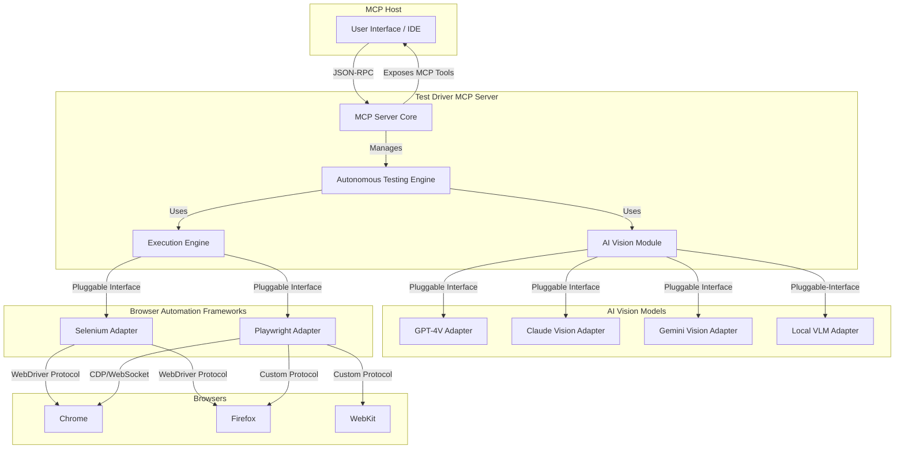
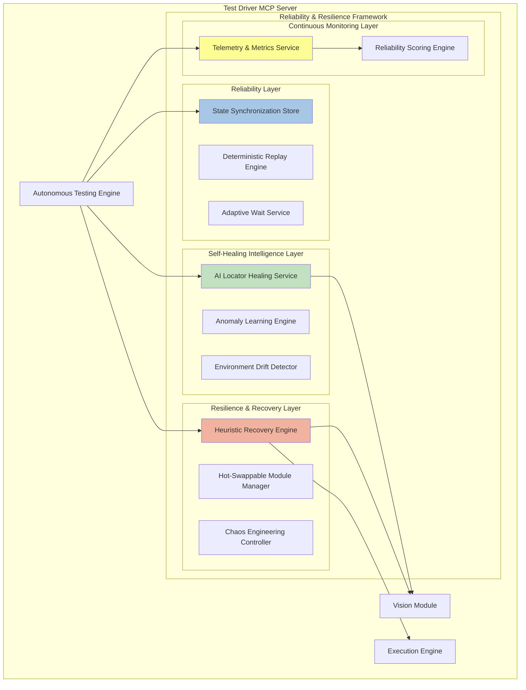
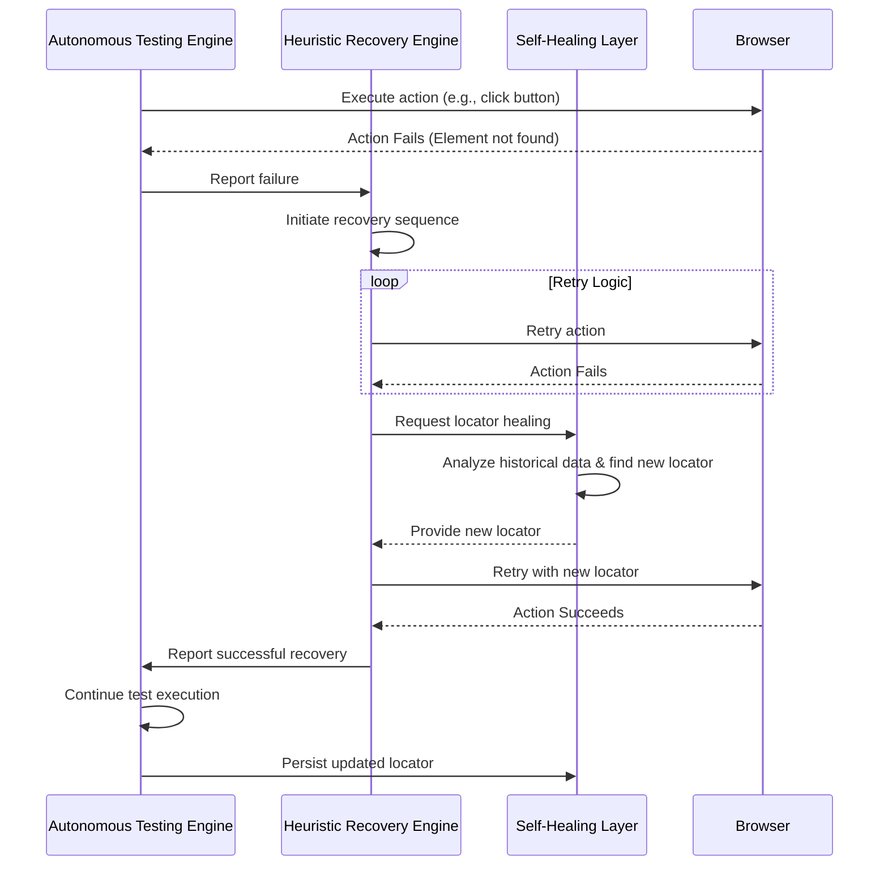

# Redesigning the Test Driver Architecture for a Modular, AI-Driven Future

## 1. Introduction

This document outlines a new, modular architecture for the Test Driver framework, designed to address the limitations of the current system and embrace a more flexible, powerful, and AI-driven approach to UI testing. The proposed architecture is built on four foundational pillars:

1.  **Decentralization and Flexibility**: Eliminating the dependency on a proprietary backend and single API key by enabling the use of local and open-source AI models.
2.  **Universal Model Compatibility**: A pluggable architecture that allows seamless integration with any agentic AI vision model, from leading proprietary APIs to self-hosted open-source alternatives.
3.  **Standardized Integration**: A Model Context Protocol (MCP) server that acts as a universal bridge, supporting both Selenium and Playwright for test execution, providing maximum flexibility and backward compatibility.
4.  **Autonomous End-to-End Testing**: Empowering the AI to not only execute tests but to understand requirements, generate comprehensive test plans, automate test cases, and deliver detailed reports.

This redesigned architecture will transform Test Driver from a closed tool into an open, extensible, and intelligent testing platform.

## 2. High-Level Architecture Overview

The new architecture is centered around the **Test Driver MCP Server**, which acts as the brain and central hub of the system. It communicates with an MCP Host (like an IDE or a chat interface) and orchestrates the two main components: the **AI Vision Module** and the **Execution Engine**.



**Key Components:**

*   **MCP Host**: The user-facing application where the testing process is initiated and monitored.
*   **Test Driver MCP Server**: The core of the system. It receives requests from the host, manages the testing lifecycle, and coordinates the other modules.
*   **Autonomous Testing Engine**: The AI-powered component responsible for test planning, generation, and reporting.
*   **AI Vision Module**: A pluggable module that provides computer vision capabilities by interfacing with various AI vision models.
*   **Execution Engine**: A pluggable module that executes browser automation commands using either Selenium or Playwright.

## 3. Component Deep Dive

### 3.1. Test Driver MCP Server

The Test Driver will be implemented as a standard MCP server, communicating via JSON-RPC 2.0. This design decouples it from any specific client and makes it universally compatible with any MCP host.

**MCP Features Exposed:**

*   **Tools**: The server will expose a rich set of tools to the MCP host, corresponding to testing actions. These tools will be dynamically generated based on the capabilities of the loaded Execution Engine adapter (Selenium/Playwright).
    *   `testdriver.startTest(requirements: string)`: Initiates the autonomous testing process.
    *   `testdriver.executeStep(action: string, params: object)`: Executes a single test step (e.g., click, type).
    *   `testdriver.getReport()`: Retrieves the latest test report.
*   **Resources**: The server will provide resources such as test plans, execution logs, screenshots, and final reports.
*   **Prompts**: The server can offer prompts for common testing scenarios, like "Perform a login test" or "Test the checkout process."

### 3.2. AI Vision Module (Pluggable)

To eliminate the dependency on a single backend and allow for flexibility, the AI Vision Module will be designed with a pluggable adapter architecture. This allows users to choose the vision model that best suits their needs for accuracy, speed, cost, and privacy.

**Standard `VisionAdapter` Interface:**

An abstract base class will define the standard interface for all vision adapters:

```python
class VisionAdapter:
    def describe_screen(self, image: bytes) -> str:
        """Returns a textual description of the entire screen."""
        pass

    def find_element(self, image: bytes, prompt: str) -> dict:
        """Finds a specific element based on a natural language prompt.
           Returns coordinates and confidence score.
        """
        pass

    def ocr(self, image: bytes) -> list:
        """Performs OCR on the image and returns text with bounding boxes."""
        pass
```

**Initial Adapters:**

*   **Proprietary Model Adapters**: `OpenAIVisionAdapter`, `AnthropicVisionAdapter`, `GoogleVisionAdapter`. These will use the respective company APIs and require API keys, but the keys will be configured on the user-side, not hardcoded in a central backend.
*   **Local VLM Adapter**: An adapter for running open-source models (like Qwen 2.5 VL or Llama 3.2 Vision) locally using frameworks like Ollama or Hugging Face Transformers. This completely eliminates external API calls and associated keys, addressing the core requirement.

### 3.3. Execution Engine (Selenium & Playwright)

To support both Selenium and Playwright, the Execution Engine will use a similar adapter pattern. This provides a unified interface for browser automation, abstracting away the differences between the two frameworks.

**Unified `BrowserDriver` Interface:**

```python
class BrowserDriver:
    def navigate(self, url: str):
        pass

    def click(self, coordinates: tuple):
        pass

    def type(self, coordinates: tuple, text: str):
        pass

    def screenshot(self) -> bytes:
        pass
```

**Framework Adapters:**

*   **`SeleniumAdapter`**: Implements the `BrowserDriver` interface using the Selenium WebDriver library. It will manage the browser drivers (chromedriver, geckodriver) and communicate via the W3C WebDriver protocol.
*   **`PlaywrightAdapter`**: Implements the `BrowserDriver` interface using the Playwright library. It will communicate with browsers over its persistent WebSocket connection.

**Dynamic Framework Selection**: The MCP server can dynamically choose which adapter to use based on the test requirements, such as the browser needed, or a user preference for speed (Playwright) vs. legacy compatibility (Selenium).

### 3.4. Autonomous Testing Engine

This engine is the core of the AI-driven functionality. It orchestrates the entire testing lifecycle, from planning to reporting.

**Workflow:**

1.  **Requirement Ingestion**: The engine receives high-level requirements as a natural language string (e.g., "Test the user registration and login flow").
2.  **Test Plan Generation**: The engine uses an AI model (which can be a separate, non-vision LLM) to break down the requirements into a structured, step-by-step test plan. This plan will be represented in a human-readable format like YAML.

    ```yaml
    test_plan:
      - description: "Navigate to the homepage and find the sign-up button."
        action: "navigate_and_click"
        params: { url: "https://example.com", element_prompt: "the sign up button" }
      - description: "Fill in the registration form."
        action: "fill_form"
        params:
          - { element_prompt: "the email input field", value: "test@example.com" }
          - { element_prompt: "the password input field", value: "password123" }
      - description: "Assert that the user is redirected to the dashboard."
        action: "assert_screen_contains"
        params: { text: "Welcome to your dashboard" }
    ```

3.  **Test Case Automation & Execution**: For each step in the plan, the engine performs the following loop:
    a.  **Capture Screen**: The `ExecutionEngine` takes a screenshot of the current browser state.
    b.  **Vision Analysis**: The screenshot and the step description (e.g., "the sign up button") are sent to the `AIVisionModule`.
    c.  **Action Planning**: The vision model returns the coordinates of the target element. The engine plans the action (e.g., a click at those coordinates).
    d.  **Execution**: The `ExecutionEngine` performs the action.
    e.  **Verification**: A new screenshot is taken, and the engine can use the vision model to assert that the expected change occurred.

4.  **Comprehensive Reporting**: After the test run, the engine compiles a detailed report including:
    *   A summary of the test plan and results.
    *   A step-by-step log with screenshots for each action.
    *   Video replay of the entire test session.
    *   Browser logs and network requests captured by the `ExecutionEngine`.
    *   AI-generated summary of any failures.

## 4. Data Flow and Workflows

A typical end-to-end test execution flow would be as follows:

1.  **User**: Provides a high-level requirement to the **MCP Host** (e.g., "Test the search functionality").
2.  **MCP Host**: Sends a `testdriver.startTest` request to the **Test Driver MCP Server**.
3.  **Autonomous Testing Engine**: Receives the request and uses an LLM to generate a YAML test plan.
4.  **Execution Loop (per step)**:
    a.  The engine instructs the **Execution Engine** (e.g., Playwright adapter) to take a screenshot.
    b.  The screenshot and the step prompt are sent to the **AI Vision Module**.
    c.  The **AI Vision Module** uses its configured adapter (e.g., Local VLM) to find the target element's coordinates.
    d.  The coordinates are returned to the engine.
    e.  The engine instructs the **Execution Engine** to perform the action (e.g., `click(x, y)`).
5.  **Reporting**: Once all steps are complete, the engine aggregates all logs, screenshots, and videos into a comprehensive HTML report and makes it available as an MCP resource.

## 5. Security Model

The architecture will adhere to the security principles of the Model Context Protocol:

*   **User Consent**: Any action that involves executing code or accessing local files will require explicit user consent, managed by the MCP Host.
*   **Data Privacy**: When using cloud-based vision models, the user will be clearly informed that screenshots are being sent to a third-party service. The ability to use a local VLM provides a fully private option.
*   **Tool Safety**: All test execution actions are treated as potentially destructive. The MCP Host will be responsible for sandboxing and providing a safe environment.

## 6. Conclusion

This proposed architecture fundamentally redesigns the Test Driver system to be more open, flexible, and intelligent. By embracing standard protocols like MCP, offering pluggable modules for AI vision and browser automation, and building a powerful autonomous testing engine, the new Test Driver will be well-positioned to lead the next generation of AI-powered software testing.


---


# Test Driver: Reliability, Resilience, and Self-Healing Framework

## 1. Introduction

This document outlines a comprehensive framework designed to enhance the reliability, resilience, and self-healing capabilities of the Test Driver system. By integrating advanced AI-driven mechanisms and proven reliability patterns, this framework will transform Test Driver into a highly robust and autonomous testing platform, capable of delivering stable, defect-free products with minimal human intervention.

## 2. Core Principles

The framework is built upon the following core principles:

- **Design for Failure**: Proactively anticipate and mitigate failures at every layer of the system.
- **Automate Recovery**: Implement automated recovery mechanisms to handle failures gracefully without manual intervention.
- **Learn from Failure**: Use machine learning to analyze failure patterns and continuously improve the system's resilience and self-healing capabilities.
- **Progressive Resilience**: Gradually introduce more complex resilience and self-healing strategies, starting with simple retries and evolving to predictive failure avoidance.
- **Observability**: Provide deep insights into the system's health, performance, and reliability through comprehensive telemetry and monitoring.

## 3. Architectural Overview

The framework introduces several new components that integrate seamlessly with the existing Test Driver architecture. These components are organized into distinct layers, each responsible for a specific aspect of reliability and resilience.



## 4. Component Deep Dive

### 4.1. Reliability Layer

**Goal**: Ensure deterministic, reproducible, and fault-tolerant test execution.

- **State Synchronization Store**: A Redux-style store that tracks the application's state (e.g., current page, active elements, user session). This allows the system to resume tests from a known good state after a failure, rather than restarting from the beginning.

- **Deterministic Replay Engine**: Captures and stores all inputs (keystrokes, clicks) and non-deterministic outputs (network responses, timestamps) during a test run. This enables pixel-perfect, deterministic replay of any test session for debugging hard-to-reproduce failures.

- **Adaptive Wait Service**: Replaces static waits with an AI-powered service that uses the Vision Module to confirm page and element readiness. It analyzes visual stability (e.g., pixel delta below a threshold) and waits for animations and network activity to cease before proceeding, reducing flakiness.

### 4.2. Resilience & Recovery Layer

**Goal**: Prevent single-point failures and automatically recover from runtime issues.

- **Heuristic Recovery Engine**: When a test step fails, this engine orchestrates a series of recovery strategies based on a predefined heuristic tree. For example:
    1.  **Retry**: Simple retry of the failed action.
    2.  **Alternate Locator**: If a locator fails, try an alternative (e.g., switch from XPath to visual search).
    3.  **UI Refresh**: Refresh the page and try again.
    4.  **Context Reset**: Clear cookies and local storage and retry.
    5.  **Fallback Action**: If all else fails, attempt a fallback action (e.g., navigate to the homepage).

- **Hot-Swappable Module Manager**: Monitors the health of critical modules like the Vision and Execution adapters. If an adapter crashes or becomes unresponsive, this manager can dynamically reload it or switch to a different adapter mid-run (e.g., from Playwright to Selenium).

- **Chaos Engineering Controller**: Integrates with the CI/CD pipeline to inject controlled faults into the test environment. This allows the system to proactively test its own resilience by simulating real-world failures like network latency, API errors, and resource contention.

### 4.3. Self-Healing Intelligence Layer

**Goal**: Enable the system to autonomously fix broken locators, flows, and assertions.

- **AI Locator Healing Service**: When a locator fails permanently, this service uses historical screenshots, DOM data, and vision embeddings to find the new, correct locator for the element. It then automatically updates the test script with the new locator and submits a pull request for human review.

- **Anomaly Learning Engine**: A reinforcement learning agent that analyzes test failure logs to identify recurring patterns. It can learn, for example, that a specific button is frequently slow to load and preemptively increase the wait time for that element in future test runs.

- **Environment Drift Detector**: Compares baseline screenshots and DOM structures between builds to automatically detect UI changes (drift). It can then trigger the AI Locator Healing Service to update affected tests before they fail.

### 4.4. Continuous Monitoring Layer

**Goal**: Provide a real-time, data-driven view of the system's reliability and health.

- **Telemetry & Metrics Service**: Collects and exposes a wide range of metrics, including test success rates, failure types, self-healing success rates, element drift frequency, and mean-time-to-recovery (MTTR). This data can be visualized in dashboards like Grafana.

- **Reliability Scoring Engine**: Computes a reliability score for each test case, module, and UI component based on historical performance. This allows the system to prioritize self-healing efforts on the most fragile parts of the application.

## 5. Failure Recovery Workflow

This sequence diagram illustrates how the framework handles a typical test failure:



## 6. Conclusion

This comprehensive framework for reliability, resilience, and self-healing represents a significant evolution for the Test Driver system. By moving beyond simple test execution to embrace autonomous recovery and continuous learning, Test Driver will be able to provide a level of quality assurance that is not possible with traditional testing tools. This will enable teams to deliver more stable, defect-free products with greater speed and confidence.


---


# Test Driver Enhancement Strategy: Comprehensive Prioritized Enhancement List

## Executive Summary

This document provides a complete, prioritized list of all proposed enhancements for the Test Driver system, integrating both user-provided ideas and additional AI-proposed capabilities. The enhancements are organized by priority tier and mapped to implementation phases, with detailed specifications for each feature including complexity, dependencies, and expected impact.

## Priority Framework

Enhancements are prioritized using a multi-dimensional scoring system that considers **Impact** (business value and quality improvement), **Complexity** (technical difficulty and resource requirements), **Dependencies** (prerequisite features), and **Risk** (implementation and operational risk). Each enhancement is assigned to one of four priority tiers that correspond to implementation phases.

---

## Priority 1: Critical Foundation (Phase 1 - Months 0-6)

These enhancements provide immediate stability improvements and establish the foundation for advanced capabilities. They focus on high-impact, manageable-complexity features that deliver rapid ROI.

| Enhancement | Source | Impact | Complexity | Dependencies | Expected Outcome |
|:---|:---|:---|:---|:---|:---|
| **State Synchronization Store** | User | High | Medium | None | Enable graceful recovery from mid-test failures; reduce test restart overhead by 60% |
| **Adaptive Wait Service** | User | High | Medium | Vision Module | Eliminate flaky tests caused by timing issues; reduce false failures by 50-70% |
| **Heuristic Recovery Engine** | User | High | Medium | State Sync Store | Implement intelligent retry strategies; reduce manual intervention by 40% |
| **AI Locator Healing (Basic)** | User | High | High | Vision Module, Historical Data Store | Automatically update broken locators; reduce maintenance effort by 30-40% |
| **Telemetry & Metrics Service** | User | High | Medium | None | Provide observability foundation; enable data-driven optimization |
| **Accessibility Scanning (axe-core)** | User | High | Low | None | Detect WCAG violations automatically; identify 100+ accessibility issues |
| **Security Scanning (SAST/SCA)** | AI | High | Medium | CI/CD Integration | Identify code and dependency vulnerabilities; detect 50+ security issues |
| **Test Data Masking Service** | AI | High | Medium | None | Enable privacy-compliant testing; support GDPR/HIPAA requirements |
| **Test Environment Health Monitoring** | AI | Medium | Low | Telemetry Service | Detect environment issues proactively; reduce environment-related failures by 30% |
| **Flaky Test Detection** | AI | Medium | Low | Telemetry Service | Automatically identify unreliable tests; quarantine flaky tests for review |

**Phase 1 Summary**: Ten critical enhancements that establish reliability, observability, and foundational self-healing. Expected to reduce flaky test failures by 40-50%, decrease maintenance effort by 30-40%, and detect 150+ accessibility and security issues. Positive ROI expected within 3-4 months.

---

## Priority 2: Advanced Capabilities (Phase 2 - Months 6-12)

These enhancements build upon the Phase 1 foundation to introduce sophisticated recovery mechanisms, proactive self-healing, and holistic quality validation across multiple dimensions.

| Enhancement | Source | Impact | Complexity | Dependencies | Expected Outcome |
|:---|:---|:---|:---|:---|:---|
| **Deterministic Replay Engine** | User | High | High | State Sync Store | Enable pixel-perfect test reproduction; reduce debugging time by 60% |
| **Hot-Swappable Module Manager** | User | High | High | Telemetry Service | Dynamically reload failed adapters; improve system resilience by 50% |
| **Environment Drift Detector** | User | High | High | Vision Module, Baseline Storage | Detect UI changes proactively; trigger preemptive healing before failures |
| **Performance Testing Module** | AI | High | Medium | CI/CD Integration | Collect client-side metrics (Lighthouse); detect performance regressions |
| **API + UI Fusion Testing** | User | High | High | Network Interception | Validate API-UI data consistency; catch integration issues |
| **Synthetic Data Generator (Basic)** | AI | High | Medium | None | Generate rule-based test data; reduce data management overhead by 40% |
| **Chaos Engineering Controller (Staging)** | User | Medium | High | Test Environment Management | Run controlled fault injection; validate system resilience |
| **Load Testing Integration (k6)** | AI | High | Medium | Performance Module | Execute load tests in CI/CD; validate scalability |
| **DAST Integration** | AI | High | Medium | Security Module | Identify runtime vulnerabilities; detect 30+ additional security issues |
| **Test Impact Analysis** | AI | High | Medium | Code Coverage Integration | Run only affected tests; reduce execution time by 30-40% |
| **Root Cause Analysis Automation** | AI | Medium | High | Telemetry Service, ML Models | Automatically identify failure patterns; accelerate diagnosis by 50% |
| **Mobile Device Testing** | AI | Medium | High | Execution Engine | Support iOS/Android testing; expand platform coverage |
| **Container Security Scanning** | AI | Medium | Medium | Security Module | Scan container images for vulnerabilities; improve deployment security |

**Phase 2 Summary**: Thirteen advanced enhancements that introduce proactive self-healing, comprehensive quality validation, and intelligent optimization. Expected to reduce maintenance effort to 60-70%, detect performance regressions affecting 20-30% of users, and accelerate root cause analysis by 50-60%.

---

## Priority 3: Autonomous Intelligence (Phase 3 - Months 12-18)

These enhancements transform the system into a fully autonomous, predictive QA platform with advanced AI-driven capabilities and production-grade resilience testing.

| Enhancement | Source | Impact | Complexity | Dependencies | Expected Outcome |
|:---|:---|:---|:---|:---|:---|
| **Predictive Failure Analytics** | User | High | Very High | ML Models, Historical Data | Forecast test failures; enable preemptive action; reduce wasted execution by 30-40% |
| **AI Co-Pilot for Debugging** | User | High | High | LLM Integration | Suggest code fixes automatically; reduce debugging time from hours to minutes |
| **Behavioral AI Persona Testing** | User | Medium | High | LLM Integration | Simulate user personas; discover subtle UX defects |
| **Anomaly Learning Engine (Full RL)** | User | Medium | Very High | ML Infrastructure | Continuously learn from failures; autonomously optimize test strategies |
| **Self-Auditing Reports** | User | High | High | AI Co-Pilot, Telemetry | Generate AI-annotated failure analysis; improve report actionability |
| **Chaos Engineering (Production)** | User | Low | Very High | Chaos Controller, Monitoring | Validate production resilience; requires mature observability |
| **Synthetic Data Generator (AI-Powered)** | AI | High | High | LLM Integration, Data Module | Generate complex relational data; improve data realism by 80% |
| **Predictive Test Selection** | AI | High | High | ML Models, Test Impact Analysis | Predict failure probability; optimize test suite execution |
| **Smart Test Ordering** | AI | Medium | Medium | Predictive Models | Prioritize tests by failure likelihood; fail fast on critical issues |
| **Multi-Modal Verification** | AI | Medium | High | Audio/Video Analysis Tools | Validate audio, video, file downloads; expand test coverage |
| **Advanced WCAG Compliance Testing** | AI | High | High | Accessibility Module | Technique-level WCAG validation; ensure comprehensive compliance |
| **Automated Environment Provisioning** | AI | Medium | High | IaC Integration | Provision test environments on-demand; reduce setup time by 70% |
| **Test Effectiveness Scoring** | AI | Medium | Medium | Telemetry Service | Measure test quality; prioritize maintenance efforts |

**Phase 3 Summary**: Thirteen autonomous enhancements that deliver predictive intelligence, advanced AI assistance, and production-grade capabilities. Expected to reduce maintenance effort to 80-90%, accelerate failure resolution by 70-80%, discover 30-40% more defects, and increase release velocity by 40-50%.

---

## Priority 4: Future Innovation (Phase 4 - Months 18+)

These enhancements represent cutting-edge capabilities and organizational transformation features that provide additional value once core autonomous capabilities are mature.

| Enhancement | Source | Impact | Complexity | Dependencies | Expected Outcome |
|:---|:---|:---|:---|:---|:---|
| **Natural Language Repair Prompts** | User | Medium | High | LLM Integration, Self-Healing | Enable conversational test repair; improve accessibility for non-technical users |
| **Collaborative Testing Platform** | AI | Medium | Medium | User Management, Permissions | Enable team collaboration; improve knowledge sharing |
| **Test Case Sharing & Reuse** | AI | Medium | Medium | Test Repository, Search | Reduce duplicate effort; accelerate test creation by 40% |
| **IoT Device Testing** | AI | Low | Very High | Device Integration Framework | Support IoT testing; expand to emerging platforms |
| **Advanced BI Integration** | AI | Medium | Medium | Reporting Module | Connect to Tableau, Power BI; enable executive dashboards |
| **Continuous Model Retraining** | AI | Medium | High | ML Infrastructure | Keep AI models current; maintain healing accuracy over time |
| **Learning from Production Incidents** | AI | High | High | Production Monitoring Integration | Feed production data into test improvement; close the feedback loop |
| **Automated Test Maintenance Prioritization** | AI | Medium | Medium | Test Effectiveness Scoring | Intelligently prioritize which tests to maintain; optimize resource allocation |
| **Configuration Drift Detection** | AI | Medium | Medium | Environment Management | Detect infrastructure configuration changes; prevent environment-related failures |
| **Privacy Compliance Verification (Full)** | AI | Medium | High | Compliance Module | Comprehensive GDPR, HIPAA, SOC2 validation; automated compliance reporting |

**Phase 4 Summary**: Ten innovative enhancements that enable organizational transformation, advanced collaboration, and continuous improvement. These features solidify Test Driver as a comprehensive, enterprise-grade QA platform.

---

## Implementation Complexity Matrix

The following table provides a detailed breakdown of implementation complexity factors for each priority tier.

| Priority Tier | Avg. Complexity | Key Technical Challenges | Resource Requirements | Timeline |
|:---|:---|:---|:---|:---|
| **Priority 1** | Medium | Integration with existing systems, basic ML model training, telemetry infrastructure | 2-3 senior engineers, 1 ML engineer | 6 months |
| **Priority 2** | Medium-High | Advanced ML models, network interception, chaos engineering safety, mobile platform support | 3-4 senior engineers, 1-2 ML engineers, 1 DevOps engineer | 6 months |
| **Priority 3** | High-Very High | Production-grade ML/RL systems, LLM integration, production chaos engineering, advanced AI features | 4-5 senior engineers, 2-3 ML engineers, 1-2 DevOps engineers | 6 months |
| **Priority 4** | Medium-High | Organizational change management, cross-team collaboration features, advanced integrations | 2-3 senior engineers, 1 product manager, 1 UX designer | 6+ months |

---

## Dependency Graph

Understanding dependencies between enhancements is critical for proper sequencing and risk management. The following relationships must be respected during implementation.

**Foundation Dependencies** (must be implemented first):
- State Synchronization Store → Deterministic Replay Engine, Heuristic Recovery Engine
- Telemetry & Metrics Service → All monitoring, scoring, and analytics features
- Vision Module → AI Locator Healing, Adaptive Wait Service, Environment Drift Detector

**Sequential Dependencies** (must follow specific order):
- AI Locator Healing (Basic) → Environment Drift Detector → Predictive Failure Analytics
- Test Impact Analysis → Predictive Test Selection → Smart Test Ordering
- Synthetic Data Generator (Basic) → Synthetic Data Generator (AI-Powered)
- Chaos Engineering (Staging) → Chaos Engineering (Production)

**Parallel Tracks** (can be developed independently):
- Security Testing Track: SAST/SCA → DAST → Container Security → API Security
- Performance Testing Track: Performance Module → Load Testing → Synthetic Monitoring
- Accessibility Testing Track: Basic Scanning → Advanced WCAG Compliance
- Data Management Track: Data Masking → Synthetic Data (Basic) → Synthetic Data (AI)

---

## Risk Assessment and Mitigation

Each priority tier carries specific risks that must be managed through appropriate mitigation strategies.

**Priority 1 Risks**: Integration complexity with existing systems may cause delays. **Mitigation**: Conduct thorough architecture review before implementation; create detailed integration specifications; implement feature flags for gradual rollout.

**Priority 2 Risks**: Chaos engineering may cause unintended disruptions; mobile testing requires significant device infrastructure. **Mitigation**: Start chaos experiments with minimal blast radius in isolated environments; use cloud-based device farms initially; implement comprehensive rollback procedures.

**Priority 3 Risks**: Production chaos engineering carries high operational risk; advanced ML/RL models may produce unpredictable results. **Mitigation**: Require extensive staging validation before production deployment; implement human-in-the-loop approval for critical AI decisions; maintain manual override capabilities; establish clear escalation procedures.

**Priority 4 Risks**: Organizational adoption challenges; integration complexity with diverse enterprise systems. **Mitigation**: Conduct change management workshops; provide comprehensive training; implement gradual rollout with pilot teams; gather continuous feedback.

---

## Expected Cumulative Impact by Phase

The following table summarizes the cumulative impact of implementing each priority tier.

| Metric | After Phase 1 | After Phase 2 | After Phase 3 | After Phase 4 |
|:---|:---|:---|:---|:---|
| **Test Maintenance Reduction** | 30-40% | 60-70% | 80-90% | 85-95% |
| **Flaky Test Reduction** | 40-50% | 70-80% | 85-95% | 90-98% |
| **Defect Detection Increase** | 20-30% | 40-50% | 60-70% | 70-80% |
| **Time-to-Resolution Reduction** | 30-40% | 50-60% | 70-80% | 75-85% |
| **Test Execution Time Reduction** | 10-15% | 30-40% | 40-50% | 45-55% |
| **Release Velocity Increase** | 15-20% | 30-35% | 40-50% | 50-60% |
| **Cost of Quality Reduction** | 20-30% | 40-50% | 50-60% | 55-65% |
| **Time to Positive ROI** | 3-4 months | 6-8 months | 12-15 months | 18-24 months |

---

## Conclusion

This prioritized enhancement list provides a clear, actionable roadmap for transforming Test Driver from a traditional test execution tool into an autonomous, intelligent quality assurance platform. By following the phased approach and respecting dependencies, organizations can achieve measurable improvements at each stage while managing risk and complexity effectively. The comprehensive scope ensures that all critical quality dimensions are addressed, from functional correctness to security, performance, accessibility, and compliance.
