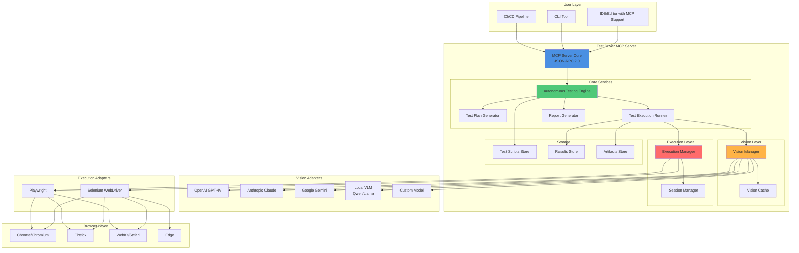
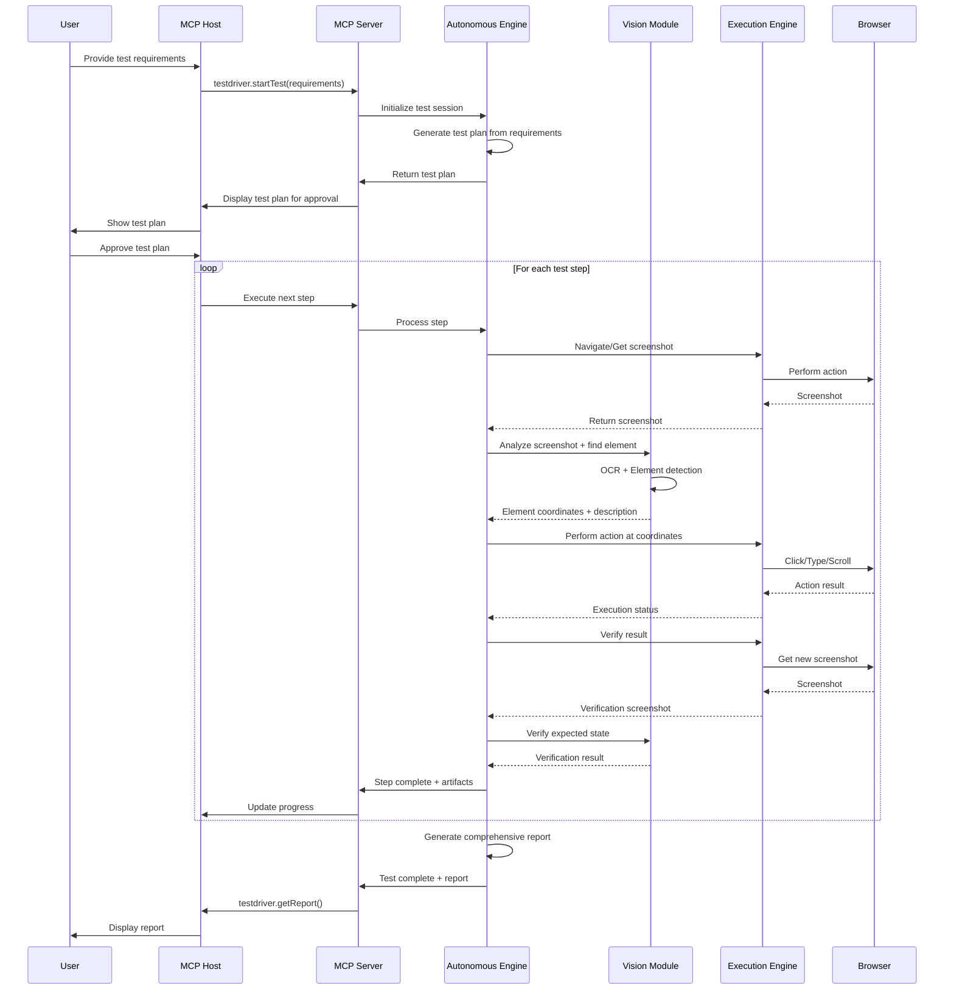
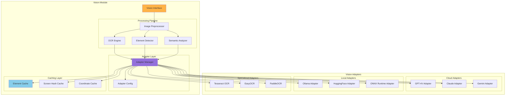
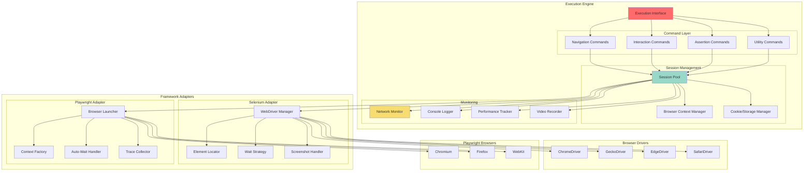
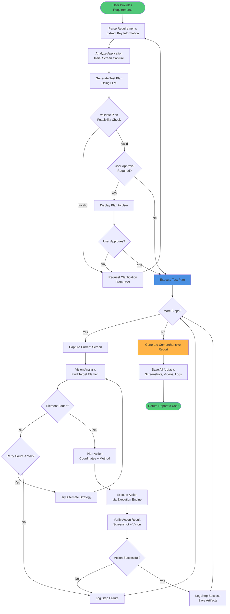
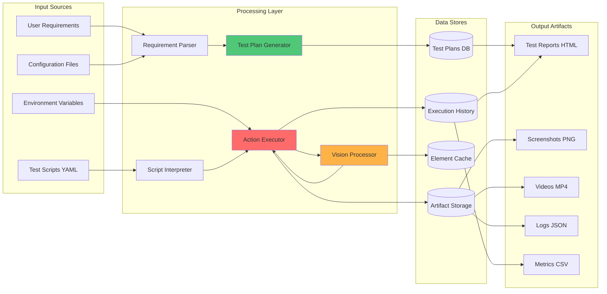
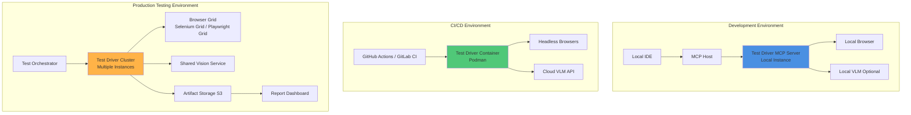
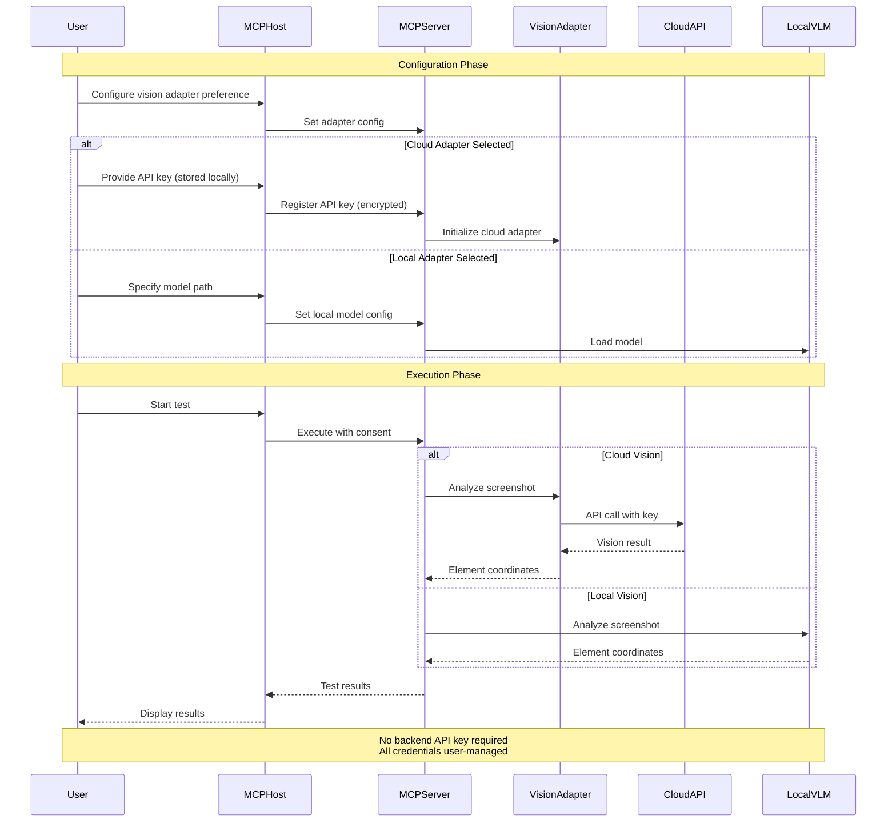

# Test Driver Architecture Diagrams

## 1. System Architecture Overview

## 2. Component Interaction Sequence

## 3. Vision Module Architecture

## 4. Execution Engine Architecture

## 5. Autonomous Testing Engine Flow

## 6. Data Flow Architecture

## 7. Deployment Architecture

## 8. Security and Authentication Flow

