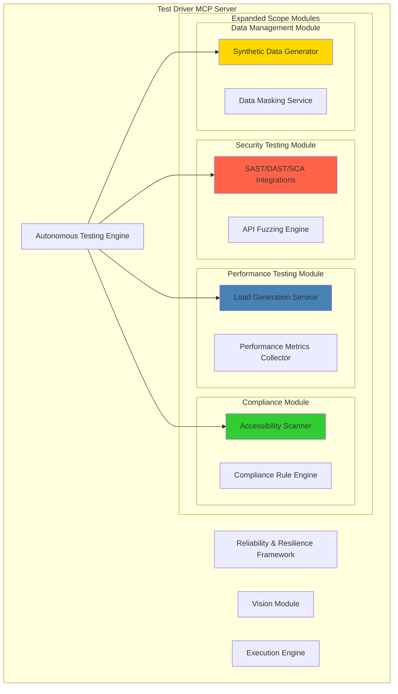
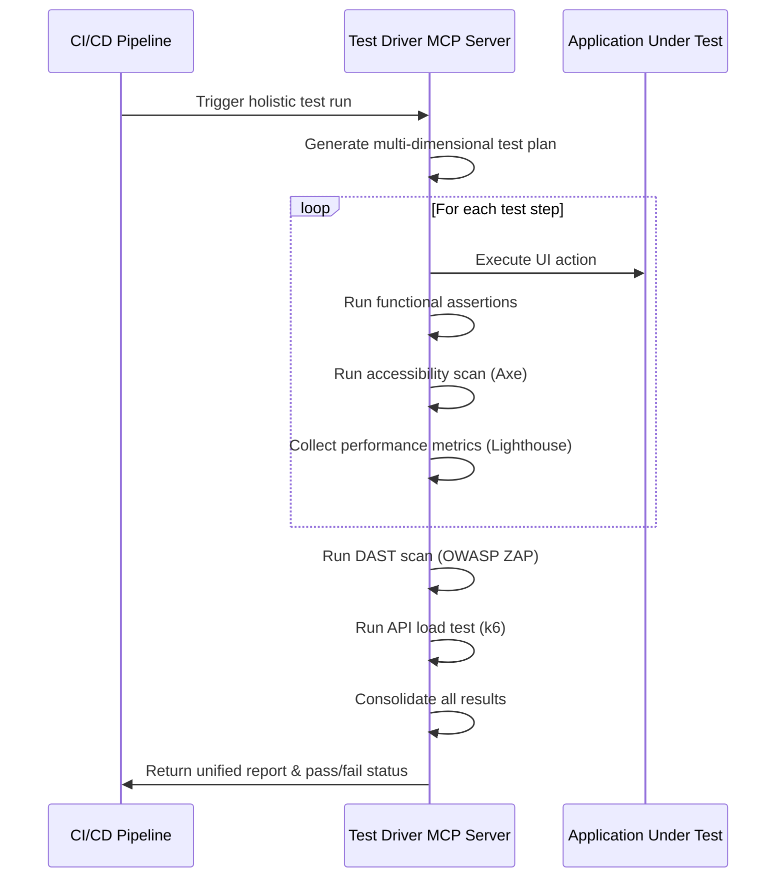

# Test Driver: Expanded Testing Scope Strategy

## 1. Introduction

To deliver truly stable, defect-free products, testing must evolve beyond traditional functional and UI verification. This document outlines a strategy to expand the scope of the Test Driver system, transforming it from a test execution tool into a holistic quality assurance platform. By integrating a wide range of testing dimensions, from security and performance to accessibility and compliance, Test Driver will be able to provide a comprehensive, 360-degree view of application quality.

## 2. Core Principles of Expanded Scope

- **Holistic Quality**: Move beyond surface-level UI testing to validate all aspects of the user experience, including performance, security, accessibility, and data integrity.
- **Shift-Left, Shift-Right**: Integrate testing activities across the entire development lifecycle, from early-stage security scans to production monitoring and chaos engineering.
- **AI-Driven Intelligence**: Leverage AI and machine learning not only for test execution but also for test data generation, persona simulation, and predictive analytics.
- **Unified Framework**: Provide a single, unified platform for managing, executing, and reporting on all types of testing, eliminating the need for disparate tools and dashboards.

## 3. New Testing Dimensions

To achieve holistic quality, the Test Driver framework will be enhanced to support the following new testing dimensions:

| Testing Dimension | Goal | Key Techniques & Tools |
| :--- | :--- | :--- |
| **Security & Privacy** | Identify and mitigate security vulnerabilities and privacy risks. | SAST (e.g., SonarQube), DAST (e.g., OWASP ZAP), SCA (e.g., Snyk), API Fuzzing. |
| **Performance & Load** | Ensure application responsiveness, scalability, and stability under load. | k6, Locust, JMeter integration; client-side performance monitoring (Lighthouse). |
| **Accessibility & Compliance** | Verify compliance with accessibility standards (WCAG) and other regulations (GDPR, HIPAA). | axe-core, Pa11y integration; automated compliance report generation. |
| **API + UI Fusion** | Validate the consistency and integrity of data between the API and the UI. | Intercept and validate API calls during UI tests; schema validation. |
| **Behavioral AI Persona** | Discover UX defects by simulating realistic user behaviors and personas. | LLM-driven user journey simulation (e.g., "impatient user," "novice user"). |
| **Data Mutation & Integrity** | Verify application robustness by injecting controlled data errors. | Automated form data mutation; API response manipulation. |
| **Multi-Modal Verification** | Test non-visual application outputs. | Audio validation (speech-to-text), video playback analysis, file download verification. |

## 4. Architectural Enhancements for Expanded Scope

Supporting these new testing dimensions requires several architectural enhancements and new components:

### 4.1. Security Testing Module

- **Integrations**: Provides adapters to integrate with popular SAST, DAST, and SCA tools. It will orchestrate scans, ingest results, and correlate security findings with specific UI interactions.
- **API Fuzzing Engine**: A built-in engine to automatically generate and send malformed data to APIs discovered during UI tests, helping to uncover security vulnerabilities.

### 4.2. Performance Testing Module

- **Load Generation Service**: Integrates with tools like k6 or Locust to run load tests defined as code. These tests can be triggered as part of the CI/CD pipeline.
- **Performance Metrics Collector**: Gathers client-side performance metrics (e.g., FCP, LCP, TTI) using tools like Lighthouse and correlates them with specific test steps.

### 4.3. Compliance Module

- **Accessibility Scanner**: Integrates with axe-core and Pa11y to automatically scan every page visited during a test run for WCAG violations.
- **Compliance Rule Engine**: A configurable engine to check for compliance with other regulations (e.g., GDPR cookie consent, HIPAA data handling) by analyzing UI text and network traffic.

### 4.4. Test Data Management Module

- **Synthetic Data Generator**: An AI-powered service that can generate realistic, context-aware test data on the fly, reducing the reliance on fragile, hardcoded data.
- **Data Masking Service**: Provides on-the-fly data masking and anonymization for tests that require production-like data, ensuring privacy compliance.

## 5. Integrated Testing Workflow

The expanded testing dimensions will be seamlessly integrated into the existing Test Driver workflow:

1.  **Test Plan Enhancement**: The Autonomous Testing Engine will enhance generated test plans to include steps for security scans, performance benchmarks, and accessibility audits at relevant points in the user journey.

2.  **CI/CD Integration**: The entire suite of tests (functional, security, performance, accessibility) can be triggered from a single command in the CI/CD pipeline, providing a unified quality gate.

3.  **Unified Reporting**: All results from all testing dimensions will be consolidated into a single, comprehensive HTML report. A security vulnerability, a performance regression, and a functional bug will all be visible in the same dashboard, providing a holistic view of application quality.

## 6. Conclusion

By expanding its scope to embrace a wide range of testing dimensions, Test Driver will move beyond simple bug detection to become a true partner in quality engineering. This holistic approach will enable teams to build more secure, performant, accessible, and reliable software, ultimately leading to higher customer satisfaction and a stronger competitive advantage.
