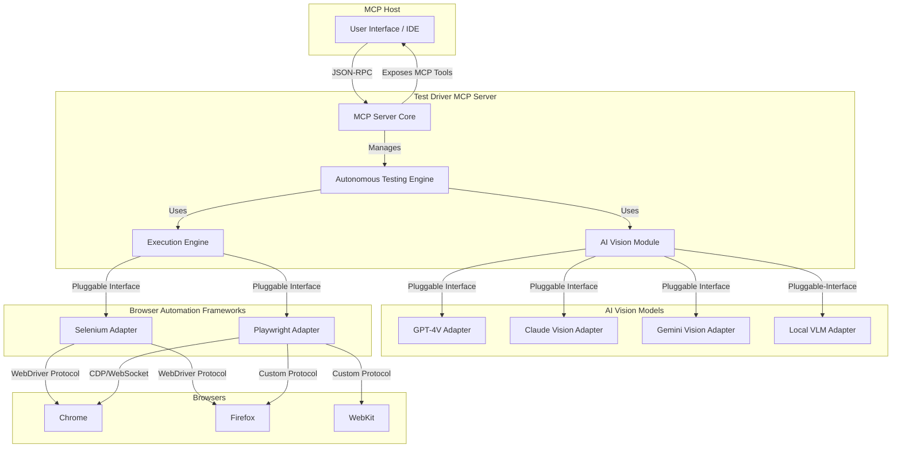
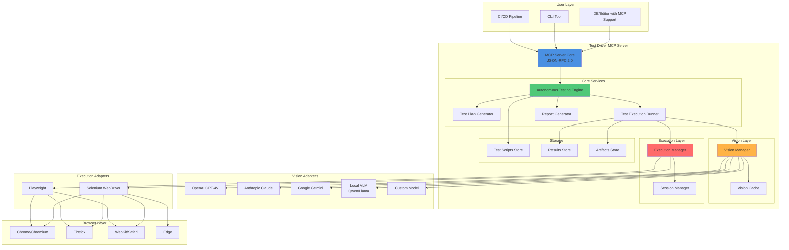
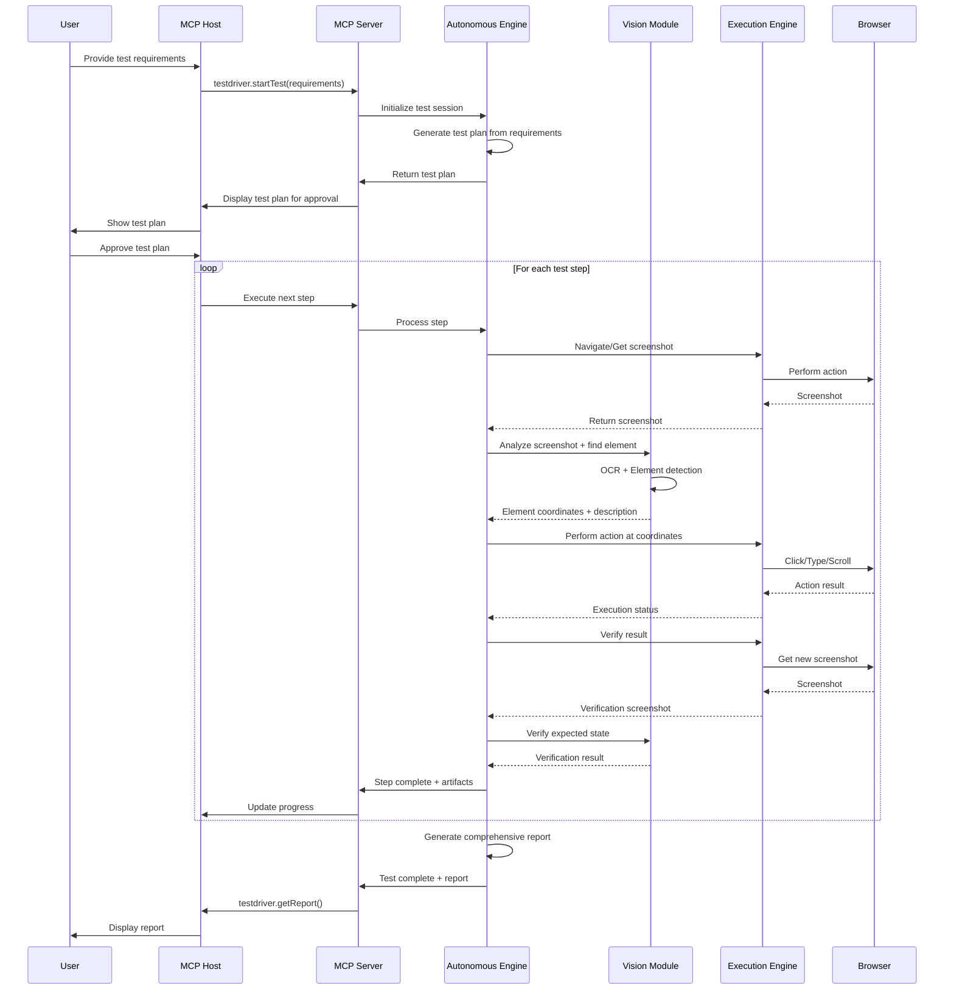
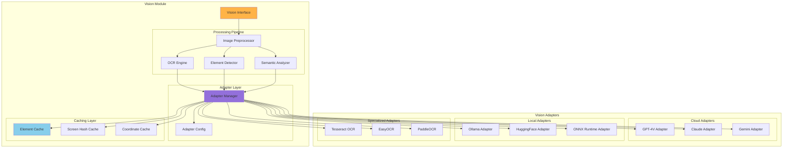
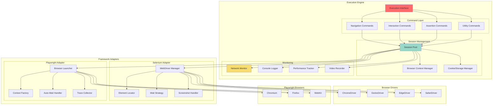
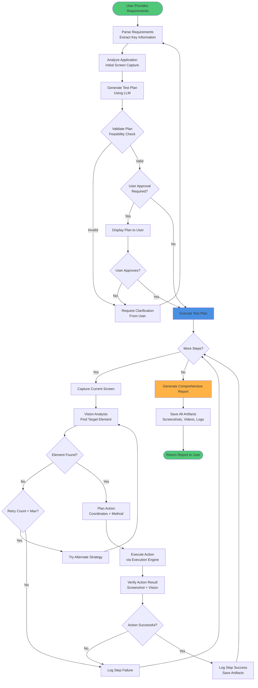
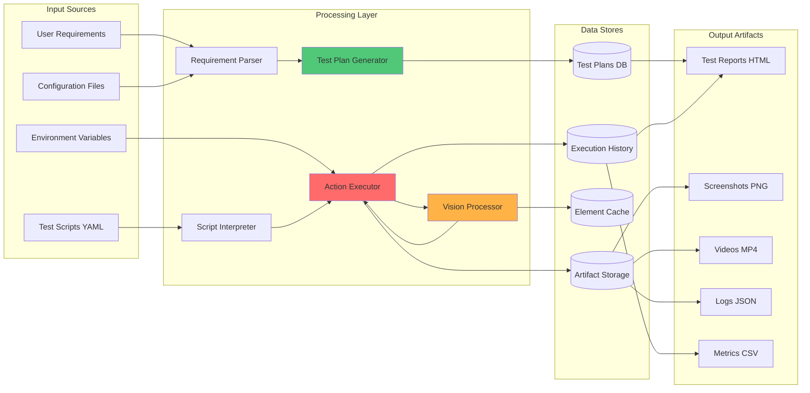
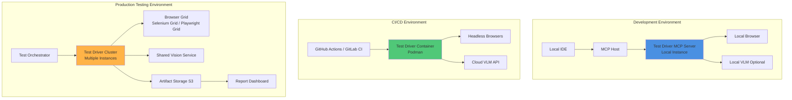
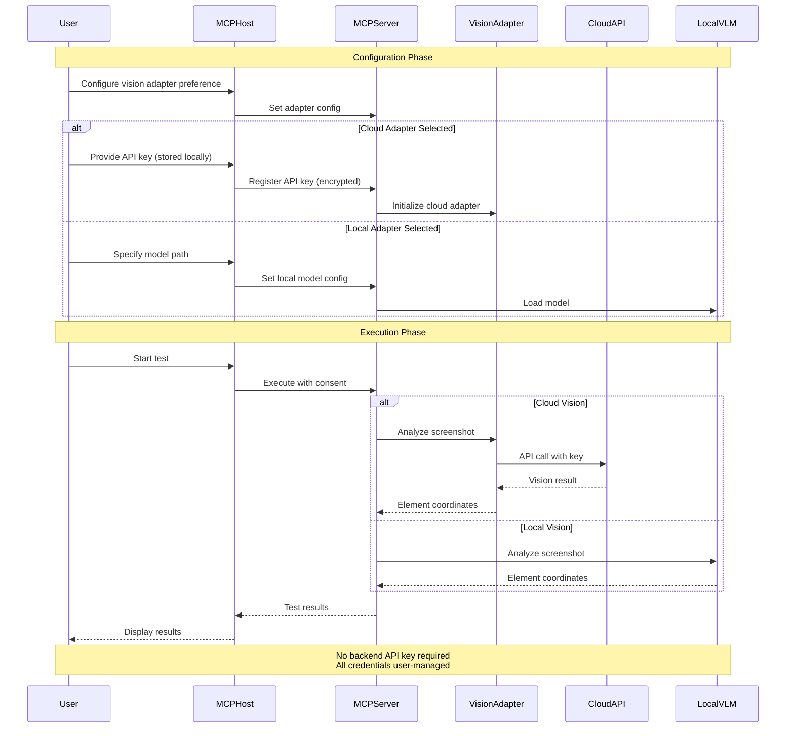

# Redesigning the Test Driver Architecture for a Modular, AI-Driven Future

## 1. Introduction

This document outlines a new, modular architecture for the Test Driver framework, designed to address the limitations of the current system and embrace a more flexible, powerful, and AI-driven approach to UI testing. The proposed architecture is built on four foundational pillars:

1.  **Decentralization and Flexibility**: Eliminating the dependency on a proprietary backend and single API key by enabling the use of local and open-source AI models.
2.  **Universal Model Compatibility**: A pluggable architecture that allows seamless integration with any agentic AI vision model, from leading proprietary APIs to self-hosted open-source alternatives.
3.  **Standardized Integration**: A Model Context Protocol (MCP) server that acts as a universal bridge, supporting both Selenium and Playwright for test execution, providing maximum flexibility and backward compatibility.
4.  **Autonomous End-to-End Testing**: Empowering the AI to not only execute tests but to understand requirements, generate comprehensive test plans, automate test cases, and deliver detailed reports.

This redesigned architecture will transform Test Driver from a closed tool into an open, extensible, and intelligent testing platform.

## 2. High-Level Architecture Overview

The new architecture is centered around the **Test Driver MCP Server**, which acts as the brain and central hub of the system. It communicates with an MCP Host (like an IDE or a chat interface) and orchestrates the two main components: the **AI Vision Module** and the **Execution Engine**.



**Key Components:**

*   **MCP Host**: The user-facing application where the testing process is initiated and monitored.
*   **Test Driver MCP Server**: The core of the system. It receives requests from the host, manages the testing lifecycle, and coordinates the other modules.
*   **Autonomous Testing Engine**: The AI-powered component responsible for test planning, generation, and reporting.
*   **AI Vision Module**: A pluggable module that provides computer vision capabilities by interfacing with various AI vision models.
*   **Execution Engine**: A pluggable module that executes browser automation commands using either Selenium or Playwright.

## 3. Component Deep Dive

### 3.1. Test Driver MCP Server

The Test Driver will be implemented as a standard MCP server, communicating via JSON-RPC 2.0. This design decouples it from any specific client and makes it universally compatible with any MCP host.

**MCP Features Exposed:**

*   **Tools**: The server will expose a rich set of tools to the MCP host, corresponding to testing actions. These tools will be dynamically generated based on the capabilities of the loaded Execution Engine adapter (Selenium/Playwright).
    *   `testdriver.startTest(requirements: string)`: Initiates the autonomous testing process.
    *   `testdriver.executeStep(action: string, params: object)`: Executes a single test step (e.g., click, type).
    *   `testdriver.getReport()`: Retrieves the latest test report.
*   **Resources**: The server will provide resources such as test plans, execution logs, screenshots, and final reports.
*   **Prompts**: The server can offer prompts for common testing scenarios, like "Perform a login test" or "Test the checkout process."

### 3.2. AI Vision Module (Pluggable)

To eliminate the dependency on a single backend and allow for flexibility, the AI Vision Module will be designed with a pluggable adapter architecture. This allows users to choose the vision model that best suits their needs for accuracy, speed, cost, and privacy.

**Standard `VisionAdapter` Interface:**

An abstract base class will define the standard interface for all vision adapters:

```python
class VisionAdapter:
    def describe_screen(self, image: bytes) -> str:
        """Returns a textual description of the entire screen."""
        pass

    def find_element(self, image: bytes, prompt: str) -> dict:
        """Finds a specific element based on a natural language prompt.
           Returns coordinates and confidence score.
        """
        pass

    def ocr(self, image: bytes) -> list:
        """Performs OCR on the image and returns text with bounding boxes."""
        pass
```

**Initial Adapters:**

*   **Proprietary Model Adapters**: `OpenAIVisionAdapter`, `AnthropicVisionAdapter`, `GoogleVisionAdapter`. These will use the respective company APIs and require API keys, but the keys will be configured on the user-side, not hardcoded in a central backend.
*   **Local VLM Adapter**: An adapter for running open-source models (like Qwen 2.5 VL or Llama 3.2 Vision) locally using frameworks like Ollama or Hugging Face Transformers. This completely eliminates external API calls and associated keys, addressing the core requirement.

### 3.3. Execution Engine (Selenium & Playwright)

To support both Selenium and Playwright, the Execution Engine will use a similar adapter pattern. This provides a unified interface for browser automation, abstracting away the differences between the two frameworks.

**Unified `BrowserDriver` Interface:**

```python
class BrowserDriver:
    def navigate(self, url: str):
        pass

    def click(self, coordinates: tuple):
        pass

    def type(self, coordinates: tuple, text: str):
        pass

    def screenshot(self) -> bytes:
        pass
```

**Framework Adapters:**

*   **`SeleniumAdapter`**: Implements the `BrowserDriver` interface using the Selenium WebDriver library. It will manage the browser drivers (chromedriver, geckodriver) and communicate via the W3C WebDriver protocol.
*   **`PlaywrightAdapter`**: Implements the `BrowserDriver` interface using the Playwright library. It will communicate with browsers over its persistent WebSocket connection.

**Dynamic Framework Selection**: The MCP server can dynamically choose which adapter to use based on the test requirements, such as the browser needed, or a user preference for speed (Playwright) vs. legacy compatibility (Selenium).

### 3.4. Autonomous Testing Engine

This engine is the core of the AI-driven functionality. It orchestrates the entire testing lifecycle, from planning to reporting.

**Workflow:**

1.  **Requirement Ingestion**: The engine receives high-level requirements as a natural language string (e.g., "Test the user registration and login flow").
2.  **Test Plan Generation**: The engine uses an AI model (which can be a separate, non-vision LLM) to break down the requirements into a structured, step-by-step test plan. This plan will be represented in a human-readable format like YAML.

    ```yaml
    test_plan:
      - description: "Navigate to the homepage and find the sign-up button."
        action: "navigate_and_click"
        params: { url: "https://example.com", element_prompt: "the sign up button" }
      - description: "Fill in the registration form."
        action: "fill_form"
        params:
          - { element_prompt: "the email input field", value: "test@example.com" }
          - { element_prompt: "the password input field", value: "password123" }
      - description: "Assert that the user is redirected to the dashboard."
        action: "assert_screen_contains"
        params: { text: "Welcome to your dashboard" }
    ```

3.  **Test Case Automation & Execution**: For each step in the plan, the engine performs the following loop:
    a.  **Capture Screen**: The `ExecutionEngine` takes a screenshot of the current browser state.
    b.  **Vision Analysis**: The screenshot and the step description (e.g., "the sign up button") are sent to the `AIVisionModule`.
    c.  **Action Planning**: The vision model returns the coordinates of the target element. The engine plans the action (e.g., a click at those coordinates).
    d.  **Execution**: The `ExecutionEngine` performs the action.
    e.  **Verification**: A new screenshot is taken, and the engine can use the vision model to assert that the expected change occurred.

4.  **Comprehensive Reporting**: After the test run, the engine compiles a detailed report including:
    *   A summary of the test plan and results.
    *   A step-by-step log with screenshots for each action.
    *   Video replay of the entire test session.
    *   Browser logs and network requests captured by the `ExecutionEngine`.
    *   AI-generated summary of any failures.

## 4. Data Flow and Workflows

A typical end-to-end test execution flow would be as follows:

1.  **User**: Provides a high-level requirement to the **MCP Host** (e.g., "Test the search functionality").
2.  **MCP Host**: Sends a `testdriver.startTest` request to the **Test Driver MCP Server**.
3.  **Autonomous Testing Engine**: Receives the request and uses an LLM to generate a YAML test plan.
4.  **Execution Loop (per step)**:
    a.  The engine instructs the **Execution Engine** (e.g., Playwright adapter) to take a screenshot.
    b.  The screenshot and the step prompt are sent to the **AI Vision Module**.
    c.  The **AI Vision Module** uses its configured adapter (e.g., Local VLM) to find the target element's coordinates.
    d.  The coordinates are returned to the engine.
    e.  The engine instructs the **Execution Engine** to perform the action (e.g., `click(x, y)`).
5.  **Reporting**: Once all steps are complete, the engine aggregates all logs, screenshots, and videos into a comprehensive HTML report and makes it available as an MCP resource.

## 5. Security Model

The architecture will adhere to the security principles of the Model Context Protocol:

*   **User Consent**: Any action that involves executing code or accessing local files will require explicit user consent, managed by the MCP Host.
*   **Data Privacy**: When using cloud-based vision models, the user will be clearly informed that screenshots are being sent to a third-party service. The ability to use a local VLM provides a fully private option.
*   **Tool Safety**: All test execution actions are treated as potentially destructive. The MCP Host will be responsible for sandboxing and providing a safe environment.

## 6. Conclusion

This proposed architecture fundamentally redesigns the Test Driver system to be more open, flexible, and intelligent. By embracing standard protocols like MCP, offering pluggable modules for AI vision and browser automation, and building a powerful autonomous testing engine, the new Test Driver will be well-positioned to lead the next generation of AI-powered software testing.
# Test Driver Architecture Diagrams

## 1. System Architecture Overview



## 2. Component Interaction Sequence



## 3. Vision Module Architecture



## 4. Execution Engine Architecture



## 5. Autonomous Testing Engine Flow



## 6. Data Flow Architecture



## 7. Deployment Architecture



## 8. Security and Authentication Flow


# Comprehensive Testing Strategy and Reporting Framework

## 1. Introduction

This document outlines a comprehensive testing strategy and reporting framework for the redesigned Test Driver architecture. The strategy is designed to ensure the quality, reliability, and performance of the new system, while the reporting framework provides deep insights into test execution and results.

## 2. Testing Strategy

The testing strategy is divided into four key areas, each targeting a different aspect of the Test Driver system.

### 2.1. Unit Testing

**Objective**: To verify the correctness of individual components and modules in isolation.

**Scope**:
- **MCP Server Core**: Test JSON-RPC message handling, tool registration, and lifecycle management.
- **AI Vision Adapters**: Mock external APIs and local models to test adapter logic for each supported vision model.
- **Execution Engine Adapters**: Test the translation of unified commands to Selenium/Playwright specific calls.
- **Autonomous Testing Engine**: Test the logic for test plan generation, step execution, and result aggregation.

**Tools**: Pytest, Mock, Unittest.

### 2.2. Integration Testing

**Objective**: To verify the interaction and data flow between different components of the Test Driver system.

**Scope**:
- **MCP Server & Adapters**: Test the dynamic loading and configuration of vision and execution adapters.
- **Autonomous Engine & Vision Module**: Test the flow of screenshots and coordinates between the engine and the vision module.
- **Autonomous Engine & Execution Engine**: Test the orchestration of browser actions and the retrieval of results.
- **Full End-to-End Flow (Mocked)**: Test the entire workflow from receiving a requirement to generating a report, with the browser and vision models mocked.

**Tools**: Pytest, Docker Compose (for setting up dependent services).

### 2.3. End-to-End (E2E) System Testing

**Objective**: To validate the entire system in a realistic environment, testing its ability to perform real-world testing tasks.

**Scope**:
- **Real Browser Automation**: Execute tests against a suite of real web applications with varying complexity.
- **Real Vision Models**: Use actual cloud APIs (with dedicated test accounts) and local VLMs to test vision capabilities.
- **Cross-Browser & Cross-Framework Testing**: Run the same test plans across different browsers (Chrome, Firefox, WebKit) and using both Selenium and Playwright adapters.
- **Autonomous Test Generation**: Test the system's ability to generate and execute test plans from high-level requirements for a variety of applications.

**Test Cases**:
- E-commerce checkout flow.
- Social media posting and interaction.
- Single Page Application (SPA) navigation and data loading.
- Form-heavy applications with complex validation.
- Applications with iframes, canvas, and other challenging elements.

### 2.4. Performance and Stress Testing

**Objective**: To measure the performance, scalability, and reliability of the system under heavy load.

**Scope**:
- **Inference Speed**: Measure the latency of different vision models for various tasks (OCR, element detection).
- **Execution Speed**: Compare the execution time of Selenium vs. Playwright adapters for the same test plan.
- **Concurrency**: Test the MCP server's ability to handle multiple concurrent test sessions.
- **Resource Usage**: Monitor CPU, memory, and network usage of the Test Driver server and its components under load.

**Tools**: Locust, JMeter, custom benchmarking scripts.

## 3. Comprehensive Reporting Framework

The reporting framework is designed to provide a multi-faceted view of the test results, catering to different stakeholders from developers to project managers.

### 3.1. Report Structure

A single, self-contained HTML report will be generated for each test run. The report will be interactive and will contain the following sections:

**1. Summary Dashboard**:
- **Overall Result**: Pass/Fail/Error.
- **Key Metrics**: Total duration, number of steps, success rate.
- **Environment Details**: Browser, OS, Execution Framework, Vision Model used.
- **AI-Generated Summary**: A natural language summary of the test run, highlighting any failures or anomalies.

**2. Test Plan View**:
- The original high-level requirement.
- The generated YAML test plan, with each step color-coded by its result (pass/fail).

**3. Step-by-Step Execution Log**:
- A detailed, expandable log for each step in the test plan.
- For each step, it will show:
    - **Description**: The natural language goal of the step.
    - **Action**: The specific action taken (e.g., `click`, `type`).
    - **Timestamps**: Start and end time for the step.
    - **Screenshots**: "Before" and "After" screenshots, with the target element highlighted.
    - **Vision Model Output**: The raw output from the vision model (e.g., coordinates, confidence score), for debugging purposes.
    - **Browser Logs**: Any console logs or errors from the browser during the step.
    - **Network Logs**: A list of network requests made during the step.

**4. Video Replay**:
- An embedded video player showing a full recording of the test execution.
- The video timeline will be synchronized with the step log, allowing users to jump to the video frame corresponding to a specific step.

**5. Artifacts**:
- A downloadable archive containing all raw artifacts, including:
    - All screenshots in full resolution.
    - The full video file.
    - Raw JSON logs.
    - The generated test plan YAML file.

### 3.2. Data Flow for Reporting

1.  **Data Collection**: During the test run, the **Autonomous Testing Engine** collects data from all modules:
    - Screenshots and videos from the **Execution Engine**.
    - Logs and metrics from the browser.
    - AI outputs from the **AI Vision Module**.
2.  **Artifact Storage**: All artifacts are stored in a structured directory for the test run.
3.  **Report Generation**: At the end of the run, the **Report Generator** component reads all the collected data and artifacts.
4.  **Template Rendering**: It uses a templating engine (like Jinja2) to render the data into the final HTML report.
5.  **Resource Embedding**: All CSS, JavaScript, and images are embedded into the HTML file to make it fully self-contained.

### 3.3. Report Example (Mockup)

```html
<!DOCTYPE html>
<html>
<head>
    <title>Test Driver Report</title>
    <!-- ... styles and scripts ... -->
</head>
<body>
    <header>
        <h1>Test Report: E-commerce Checkout</h1>
        <div class="summary pass">Overall Result: PASS</div>
    </header>

    <section id="dashboard">
        <!-- ... Key metrics and environment details ... -->
        <div class="ai-summary">
            <h3>AI Summary</h3>
            <p>The test successfully completed the checkout process. All steps passed, and the final confirmation page was verified.</p>
        </div>
    </section>

    <section id="test-plan">
        <!-- ... YAML test plan view ... -->
    </section>

    <section id="execution-log">
        <div class="step pass">
            <h3>Step 1: Navigate and click login</h3>
            <div class="screenshots">
                
                
            </div>
            <!-- ... logs and details ... -->
        </div>
        <!-- ... more steps ... -->
    </section>

    <section id="video-replay">
        <video controls>
            <source src="test_replay.mp4" type="video/mp4">
        </video>
    </section>
</body>
</html>
```

## 4. Conclusion

This comprehensive testing strategy ensures that the redesigned Test Driver is robust, reliable, and performant. The detailed and insightful reporting framework will provide unparalleled visibility into the testing process, empowering developers and QA teams to build better software faster.
