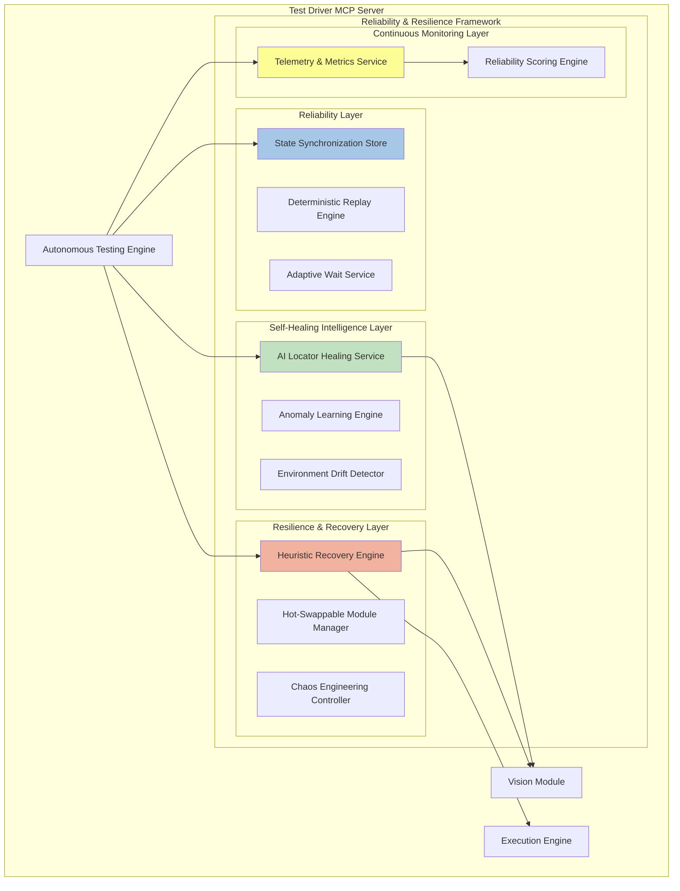
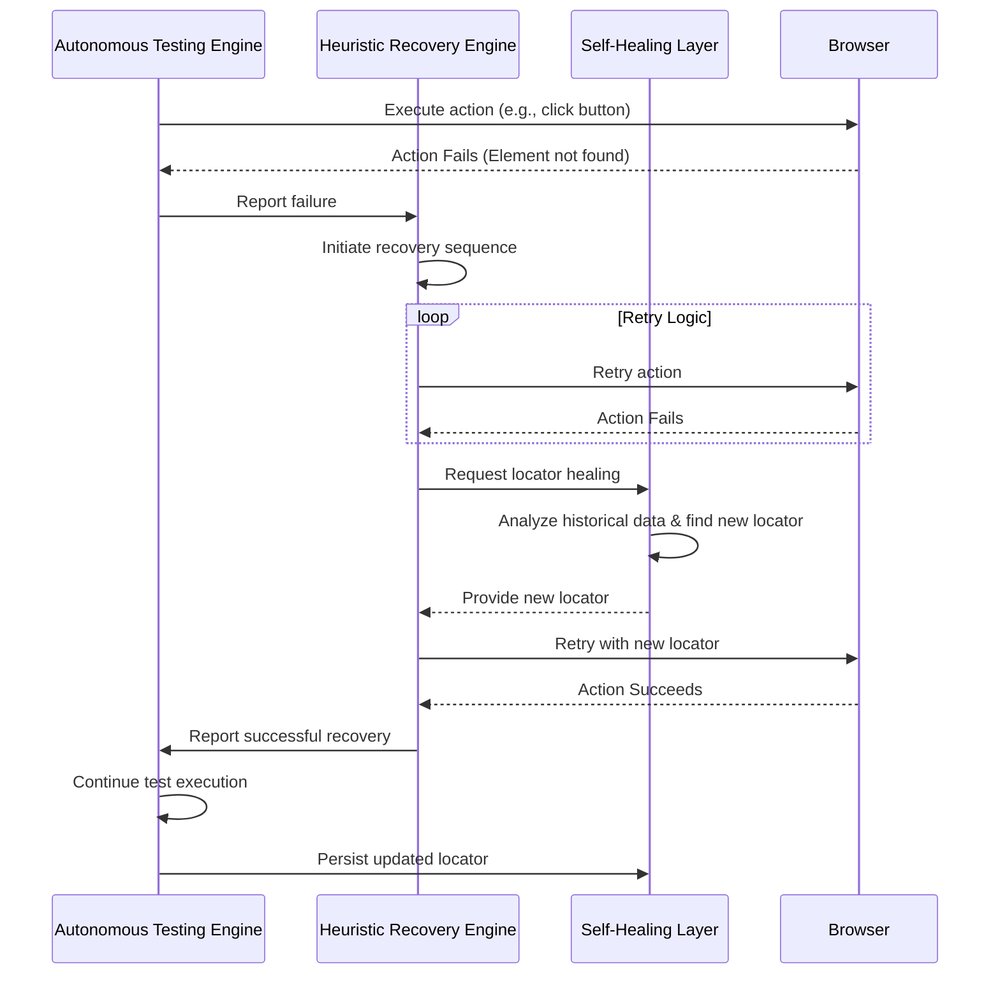
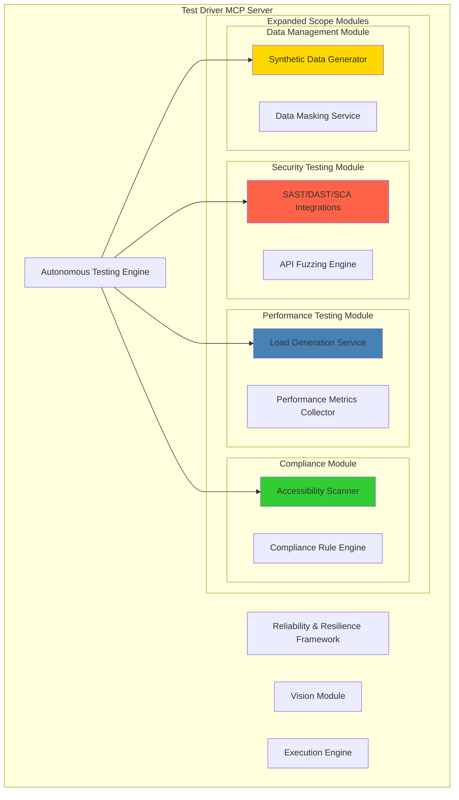
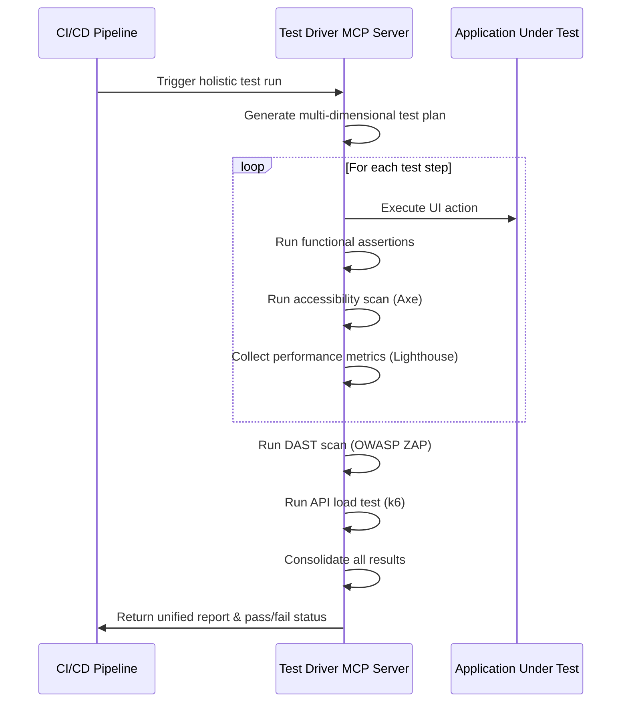

# Analysis of Enhancement Ideas

## User's Proposed Enhancements - Summary

The user has provided an excellent foundation for enhancing the Test Driver system across seven key areas:

### 1. Reliability Reinforcements
- State synchronization layer with state machine
- Deterministic replay engine for debugging
- Adaptive waits with AI-assisted visual stability checks
- Smart dependency injection for configuration management

### 2. Resilience & Fault Recovery
- Micro-recovery logic with alternate strategies
- Isolated execution containers with crash recovery
- Hot-swappable modules for adapter failover
- Self-diagnosis and auto-repair subsystem

### 3. Self-Healing Intelligence
- AI locator healing using vision embeddings
- Anomaly pattern learning with reinforcement learning
- Environment drift detection
- Natural language repair prompts

### 4. Expanded Test Scope
- Cross-platform and accessibility testing
- API + UI fusion testing
- Behavioral AI testing with user personas
- Data mutation testing

### 5. Continuous Reliability Monitoring
- Telemetry dashboard with metrics
- Heuristic scoring for test reliability
- Auto-retrain hooks for vision models

### 6. DevOps Integration
- Canary test promotion
- Chaos engineering mode
- Hybrid testing grid with Kubernetes

### 7. Future-Facing Enhancements
- Predictive failure analytics
- AI co-pilot for debugging
- Self-auditing reports

## Identified Gaps and Additional Enhancement Opportunities

While the user's ideas are comprehensive, there are several additional areas that can further strengthen the system:

### Gap 1: Security and Privacy Testing
No mention of security testing, vulnerability scanning, or privacy compliance verification.

### Gap 2: Performance and Load Testing Integration
Limited focus on performance regression detection and load testing capabilities.

### Gap 3: Multi-Modal Testing
No coverage of testing beyond visual UI (audio, video, file downloads, print outputs).

### Gap 4: Test Data Management
Missing strategy for test data generation, masking, and lifecycle management.

### Gap 5: Collaborative Testing Features
No mention of team collaboration, test case sharing, or distributed test authoring.

### Gap 6: Compliance and Regulatory Testing
Missing automated compliance testing for standards like WCAG, GDPR, SOC2, HIPAA.

### Gap 7: Mobile and IoT Testing
Limited discussion of mobile-specific testing and IoT device testing.

### Gap 8: Test Optimization and Deduplication
No strategy for identifying redundant tests or optimizing test suite execution time.

### Gap 9: Root Cause Analysis Automation
Missing automated root cause analysis beyond simple failure detection.

### Gap 10: Test Environment Management
No discussion of environment provisioning, configuration drift, or environment-specific test adaptation.
# Research Findings: Advanced Testing Techniques and Reliability Patterns

## 1. Self-Healing Test Automation

Self-healing test automation uses AI and machine learning to automatically detect application changes and update test scripts without manual intervention. This approach significantly reduces test maintenance overhead and improves test resilience.

### Key Techniques

**Intelligent Locator Strategies**: Modern self-healing frameworks use multiple locator strategies in parallel, including ID, name, CSS selectors, XPath, and visual recognition. When one locator fails, the system automatically tries alternatives.

**AI-Powered Element Recognition**: Machine learning models analyze UI elements using visual features, text content, position, and context to identify elements even when traditional locators change.

**Historical Pattern Analysis**: Systems maintain a history of successful element identifications and use this data to predict the most reliable locator strategy for future tests.

**Semantic Understanding**: Advanced systems use natural language processing to understand the semantic meaning of UI elements, allowing them to adapt to text changes while maintaining functional equivalence.

## 2. Chaos Engineering and Fault Injection

Chaos engineering is a disciplined approach to identifying failures before they become outages by proactively testing how systems respond under stress.

### Core Principles

**Build Hypothesis Around Steady State**: Define measurable output that indicates normal system behavior before introducing chaos.

**Vary Real-World Events**: Simulate realistic failure scenarios including network latency, server failures, disk failures, and resource exhaustion.

**Run Experiments in Production**: While starting in staging environments, the ultimate goal is to run chaos experiments in production with minimal blast radius.

**Automate Experiments**: Chaos experiments should run continuously as part of the CI/CD pipeline to catch regressions early.

**Minimize Blast Radius**: Start with small, controlled experiments and gradually increase scope as confidence grows.

### Fault Injection Techniques

**Network Faults**: Introduce latency, packet loss, bandwidth restrictions, and connection failures.

**Resource Faults**: Simulate CPU exhaustion, memory pressure, disk space limitations, and file descriptor limits.

**Application Faults**: Inject exceptions, corrupt data, trigger edge cases, and simulate dependency failures.

**State Faults**: Introduce clock skew, corrupt configuration, and trigger race conditions.

## 3. Test Data Management

Effective test data management ensures that tests have access to realistic, compliant, and maintainable data throughout the testing lifecycle.

### Best Practices

**Data Isolation**: Maintain strict separation between production data and test data to prevent contamination and ensure data integrity.

**Synthetic Data Generation**: Use AI and statistical models to generate realistic test data that mimics production characteristics without exposing sensitive information.

**Data Masking and Anonymization**: Apply techniques like pseudonymization, encryption, redaction, and shuffling to protect sensitive data in test environments.

**Subset and Sampling**: Extract representative subsets of production data for testing rather than copying entire databases.

**Version Control**: Treat test data as code and maintain it in version control systems with proper documentation.

**Data Refresh Strategies**: Implement automated processes to refresh test data regularly, ensuring tests reflect current application states.

### Synthetic Data Generation Approaches

**Rule-Based Generation**: Define rules and constraints to generate data that meets specific business logic requirements.

**Statistical Modeling**: Analyze production data distributions and generate synthetic data with matching statistical properties.

**AI-Powered Generation**: Use generative AI models to create realistic data including text, images, and complex relational structures.

**Template-Based Generation**: Define data templates with variable components that can be populated dynamically.

## 4. Accessibility Testing Automation

Automated accessibility testing ensures digital products comply with WCAG guidelines and are usable by people with disabilities.

### Leading Tools and Frameworks

**axe-core**: Open-source accessibility testing engine that integrates seamlessly with testing frameworks. Detects approximately 57% of WCAG issues automatically.

**Pa11y**: Command-line tool and JavaScript library for automated accessibility testing. Can be integrated into CI/CD pipelines.

**WAVE**: Web accessibility evaluation tool that provides visual feedback about accessibility issues directly on web pages.

**Lighthouse**: Google's automated tool for improving web page quality, including accessibility audits.

### Coverage and Limitations

Automated tools can detect approximately 30-40% of accessibility issues. The remaining 60-70% require manual testing by humans, particularly for:

- Keyboard navigation flow and logical tab order
- Screen reader compatibility and meaningful labels
- Color contrast in complex scenarios
- Cognitive load and content comprehension
- Alternative text quality and relevance

### Integration Strategy

**CI/CD Integration**: Run automated accessibility scans on every commit and pull request.

**Layered Testing**: Combine multiple tools (axe-core + Pa11y) to maximize issue detection coverage.

**Regression Prevention**: Maintain baseline accessibility scores and fail builds that introduce new violations.

**Manual Testing Workflow**: Use automated results to prioritize manual testing efforts on high-risk areas.

## 5. Resilience Patterns in Distributed Systems

Modern applications require resilience patterns to maintain availability and reliability in the face of failures.

### Key Patterns

**Circuit Breaker**: Prevents cascading failures by stopping requests to failing services and allowing them time to recover.

**Retry with Exponential Backoff**: Automatically retries failed operations with increasing delays to handle transient failures.

**Timeout Pattern**: Sets maximum wait times for operations to prevent resource exhaustion from hanging requests.

**Bulkhead Pattern**: Isolates resources to prevent failures in one area from affecting the entire system.

**Fallback Pattern**: Provides alternative responses or degraded functionality when primary services fail.

**Cache-Aside Pattern**: Uses caching to reduce load on backend services and provide resilience during outages.

## 6. Performance and Load Testing Integration

Performance testing should be integrated into the continuous testing pipeline to catch regressions early.

### Approaches

**Shift-Left Performance Testing**: Run lightweight performance tests on every commit to catch issues early.

**Synthetic Monitoring**: Continuously monitor application performance from multiple geographic locations.

**Load Testing as Code**: Define load test scenarios in code and version control them alongside application code.

**Performance Budgets**: Set thresholds for key metrics (response time, throughput, error rate) and fail builds that exceed them.

**Distributed Load Generation**: Use cloud-based load generators to simulate realistic user loads from multiple regions.

## 7. Security Testing Automation

Security testing should be automated and integrated throughout the development lifecycle.

### Key Approaches

**Static Application Security Testing (SAST)**: Analyze source code for security vulnerabilities without executing the application.

**Dynamic Application Security Testing (DAST)**: Test running applications for vulnerabilities by simulating attacks.

**Software Composition Analysis (SCA)**: Scan dependencies for known vulnerabilities and license compliance issues.

**Container Security Scanning**: Analyze container images for vulnerabilities and misconfigurations.

**API Security Testing**: Validate authentication, authorization, input validation, and rate limiting.

## 8. Test Optimization and Intelligence

Modern testing platforms use AI and analytics to optimize test execution and improve efficiency.

### Techniques

**Test Impact Analysis**: Identify which tests are affected by code changes and run only relevant tests.

**Predictive Test Selection**: Use machine learning to predict which tests are most likely to fail based on code changes.

**Test Parallelization**: Distribute tests across multiple execution environments to reduce overall execution time.

**Flaky Test Detection**: Automatically identify and quarantine unreliable tests that produce inconsistent results.

**Test Deduplication**: Analyze test coverage and identify redundant tests that can be safely removed.

**Smart Test Ordering**: Prioritize tests based on failure probability, execution time, and business criticality.
# Test Driver: Reliability, Resilience, and Self-Healing Framework

## 1. Introduction

This document outlines a comprehensive framework designed to enhance the reliability, resilience, and self-healing capabilities of the Test Driver system. By integrating advanced AI-driven mechanisms and proven reliability patterns, this framework will transform Test Driver into a highly robust and autonomous testing platform, capable of delivering stable, defect-free products with minimal human intervention.

## 2. Core Principles

The framework is built upon the following core principles:

- **Design for Failure**: Proactively anticipate and mitigate failures at every layer of the system.
- **Automate Recovery**: Implement automated recovery mechanisms to handle failures gracefully without manual intervention.
- **Learn from Failure**: Use machine learning to analyze failure patterns and continuously improve the system's resilience and self-healing capabilities.
- **Progressive Resilience**: Gradually introduce more complex resilience and self-healing strategies, starting with simple retries and evolving to predictive failure avoidance.
- **Observability**: Provide deep insights into the system's health, performance, and reliability through comprehensive telemetry and monitoring.

## 3. Architectural Overview

The framework introduces several new components that integrate seamlessly with the existing Test Driver architecture. These components are organized into distinct layers, each responsible for a specific aspect of reliability and resilience.

## 4. Component Deep Dive

### 4.1. Reliability Layer

**Goal**: Ensure deterministic, reproducible, and fault-tolerant test execution.

- **State Synchronization Store**: A Redux-style store that tracks the application's state (e.g., current page, active elements, user session). This allows the system to resume tests from a known good state after a failure, rather than restarting from the beginning.

- **Deterministic Replay Engine**: Captures and stores all inputs (keystrokes, clicks) and non-deterministic outputs (network responses, timestamps) during a test run. This enables pixel-perfect, deterministic replay of any test session for debugging hard-to-reproduce failures.

- **Adaptive Wait Service**: Replaces static waits with an AI-powered service that uses the Vision Module to confirm page and element readiness. It analyzes visual stability (e.g., pixel delta below a threshold) and waits for animations and network activity to cease before proceeding, reducing flakiness.

### 4.2. Resilience & Recovery Layer

**Goal**: Prevent single-point failures and automatically recover from runtime issues.

- **Heuristic Recovery Engine**: When a test step fails, this engine orchestrates a series of recovery strategies based on a predefined heuristic tree. For example:
    1.  **Retry**: Simple retry of the failed action.
    2.  **Alternate Locator**: If a locator fails, try an alternative (e.g., switch from XPath to visual search).
    3.  **UI Refresh**: Refresh the page and try again.
    4.  **Context Reset**: Clear cookies and local storage and retry.
    5.  **Fallback Action**: If all else fails, attempt a fallback action (e.g., navigate to the homepage).

- **Hot-Swappable Module Manager**: Monitors the health of critical modules like the Vision and Execution adapters. If an adapter crashes or becomes unresponsive, this manager can dynamically reload it or switch to a different adapter mid-run (e.g., from Playwright to Selenium).

- **Chaos Engineering Controller**: Integrates with the CI/CD pipeline to inject controlled faults into the test environment. This allows the system to proactively test its own resilience by simulating real-world failures like network latency, API errors, and resource contention.

### 4.3. Self-Healing Intelligence Layer

**Goal**: Enable the system to autonomously fix broken locators, flows, and assertions.

- **AI Locator Healing Service**: When a locator fails permanently, this service uses historical screenshots, DOM data, and vision embeddings to find the new, correct locator for the element. It then automatically updates the test script with the new locator and submits a pull request for human review.

- **Anomaly Learning Engine**: A reinforcement learning agent that analyzes test failure logs to identify recurring patterns. It can learn, for example, that a specific button is frequently slow to load and preemptively increase the wait time for that element in future test runs.

- **Environment Drift Detector**: Compares baseline screenshots and DOM structures between builds to automatically detect UI changes (drift). It can then trigger the AI Locator Healing Service to update affected tests before they fail.

### 4.4. Continuous Monitoring Layer

**Goal**: Provide a real-time, data-driven view of the system's reliability and health.

- **Telemetry & Metrics Service**: Collects and exposes a wide range of metrics, including test success rates, failure types, self-healing success rates, element drift frequency, and mean-time-to-recovery (MTTR). This data can be visualized in dashboards like Grafana.

- **Reliability Scoring Engine**: Computes a reliability score for each test case, module, and UI component based on historical performance. This allows the system to prioritize self-healing efforts on the most fragile parts of the application.

## 5. Failure Recovery Workflow

This sequence diagram illustrates how the framework handles a typical test failure:

## 6. Conclusion

This comprehensive framework for reliability, resilience, and self-healing represents a significant evolution for the Test Driver system. By moving beyond simple test execution to embrace autonomous recovery and continuous learning, Test Driver will be able to provide a level of quality assurance that is not possible with traditional testing tools. This will enable teams to deliver more stable, defect-free products with greater speed and confidence.
# Test Driver: Expanded Testing Scope Strategy

## 1. Introduction

To deliver truly stable, defect-free products, testing must evolve beyond traditional functional and UI verification. This document outlines a strategy to expand the scope of the Test Driver system, transforming it from a test execution tool into a holistic quality assurance platform. By integrating a wide range of testing dimensions, from security and performance to accessibility and compliance, Test Driver will be able to provide a comprehensive, 360-degree view of application quality.

## 2. Core Principles of Expanded Scope

- **Holistic Quality**: Move beyond surface-level UI testing to validate all aspects of the user experience, including performance, security, accessibility, and data integrity.
- **Shift-Left, Shift-Right**: Integrate testing activities across the entire development lifecycle, from early-stage security scans to production monitoring and chaos engineering.
- **AI-Driven Intelligence**: Leverage AI and machine learning not only for test execution but also for test data generation, persona simulation, and predictive analytics.
- **Unified Framework**: Provide a single, unified platform for managing, executing, and reporting on all types of testing, eliminating the need for disparate tools and dashboards.

## 3. New Testing Dimensions

To achieve holistic quality, the Test Driver framework will be enhanced to support the following new testing dimensions:

| Testing Dimension | Goal | Key Techniques & Tools |
| :--- | :--- | :--- |
| **Security & Privacy** | Identify and mitigate security vulnerabilities and privacy risks. | SAST (e.g., SonarQube), DAST (e.g., OWASP ZAP), SCA (e.g., Snyk), API Fuzzing. |
| **Performance & Load** | Ensure application responsiveness, scalability, and stability under load. | k6, Locust, JMeter integration; client-side performance monitoring (Lighthouse). |
| **Accessibility & Compliance** | Verify compliance with accessibility standards (WCAG) and other regulations (GDPR, HIPAA). | axe-core, Pa11y integration; automated compliance report generation. |
| **API + UI Fusion** | Validate the consistency and integrity of data between the API and the UI. | Intercept and validate API calls during UI tests; schema validation. |
| **Behavioral AI Persona** | Discover UX defects by simulating realistic user behaviors and personas. | LLM-driven user journey simulation (e.g., "impatient user," "novice user"). |
| **Data Mutation & Integrity** | Verify application robustness by injecting controlled data errors. | Automated form data mutation; API response manipulation. |
| **Multi-Modal Verification** | Test non-visual application outputs. | Audio validation (speech-to-text), video playback analysis, file download verification. |

## 4. Architectural Enhancements for Expanded Scope

Supporting these new testing dimensions requires several architectural enhancements and new components:

### 4.1. Security Testing Module

- **Integrations**: Provides adapters to integrate with popular SAST, DAST, and SCA tools. It will orchestrate scans, ingest results, and correlate security findings with specific UI interactions.
- **API Fuzzing Engine**: A built-in engine to automatically generate and send malformed data to APIs discovered during UI tests, helping to uncover security vulnerabilities.

### 4.2. Performance Testing Module

- **Load Generation Service**: Integrates with tools like k6 or Locust to run load tests defined as code. These tests can be triggered as part of the CI/CD pipeline.
- **Performance Metrics Collector**: Gathers client-side performance metrics (e.g., FCP, LCP, TTI) using tools like Lighthouse and correlates them with specific test steps.

### 4.3. Compliance Module

- **Accessibility Scanner**: Integrates with axe-core and Pa11y to automatically scan every page visited during a test run for WCAG violations.
- **Compliance Rule Engine**: A configurable engine to check for compliance with other regulations (e.g., GDPR cookie consent, HIPAA data handling) by analyzing UI text and network traffic.

### 4.4. Test Data Management Module

- **Synthetic Data Generator**: An AI-powered service that can generate realistic, context-aware test data on the fly, reducing the reliance on fragile, hardcoded data.
- **Data Masking Service**: Provides on-the-fly data masking and anonymization for tests that require production-like data, ensuring privacy compliance.

## 5. Integrated Testing Workflow

The expanded testing dimensions will be seamlessly integrated into the existing Test Driver workflow:

1.  **Test Plan Enhancement**: The Autonomous Testing Engine will enhance generated test plans to include steps for security scans, performance benchmarks, and accessibility audits at relevant points in the user journey.

2.  **CI/CD Integration**: The entire suite of tests (functional, security, performance, accessibility) can be triggered from a single command in the CI/CD pipeline, providing a unified quality gate.

3.  **Unified Reporting**: All results from all testing dimensions will be consolidated into a single, comprehensive HTML report. A security vulnerability, a performance regression, and a functional bug will all be visible in the same dashboard, providing a holistic view of application quality.

## 6. Conclusion

By expanding its scope to embrace a wide range of testing dimensions, Test Driver will move beyond simple bug detection to become a true partner in quality engineering. This holistic approach will enable teams to build more secure, performant, accessible, and reliable software, ultimately leading to higher customer satisfaction and a stronger competitive advantage.
# Test Driver Enhancement: Implementation Roadmap & Best Practices

## 1. Introduction

This document provides a strategic implementation roadmap and a set of best practices for rolling out the enhanced reliability, resilience, self-healing, and expanded scope capabilities for the Test Driver system. The roadmap is divided into three distinct phases, allowing for a progressive and manageable adoption of the new features, ensuring stability and value at each stage.

## 2. Phased Implementation Roadmap

The implementation is structured into three phases: Foundational, Advanced, and Future-Facing. This approach prioritizes the most critical stability features first, building a solid base before introducing more complex, AI-driven capabilities.

### Phase 1: Foundational Reliability & Core Scope Expansion (Months 0-6)

**Goal**: Establish a baseline of improved reliability and integrate critical, high-value testing dimensions.

| Feature | Description | Priority | Complexity |
| :--- | :--- | :--- | :--- |
| **State Synchronization Store** | Implement the core state machine to enable graceful recovery from mid-test failures. | **High** | Medium |
| **Adaptive Wait Service** | Replace all static waits with AI-powered visual stability checks to reduce flakiness. | **High** | Medium |
| **Heuristic Recovery Engine** | Implement basic recovery strategies like smart retries and page refreshes. | **High** | Medium |
| **AI Locator Healing (Basic)** | Introduce the initial version of locator healing, suggesting fixes via pull requests. | **High** | High |
| **Telemetry & Metrics Service** | Set up basic Grafana/Prometheus dashboards to monitor test success and failure rates. | **High** | Medium |
| **Accessibility Scanning** | Integrate `axe-core` to run automated WCAG scans on every page load. | **High** | Low |
| **Security Scanning (SAST/SCA)** | Integrate SAST and SCA tools into the CI/CD pipeline to scan code and dependencies. | **High** | Medium |

**Outcome of Phase 1**: A significantly more stable and reliable testing process with foundational self-healing and critical accessibility and security checks integrated into the CI/CD pipeline.

### Phase 2: Advanced Self-Healing & Holistic Testing (Months 6-12)

**Goal**: Build upon the foundational layer with more sophisticated self-healing mechanisms and a broader, more holistic view of application quality.

| Feature | Description | Priority | Complexity |
| :--- | :--- | :--- | :--- |
| **Deterministic Replay Engine** | Enable pixel-perfect replay of test sessions for advanced debugging. | Medium | High |
| **Hot-Swappable Modules** | Allow dynamic reloading of crashed or unresponsive vision/execution adapters. | Medium | High |
| **Environment Drift Detector** | Automatically detect UI changes between builds and flag tests for healing. | **High** | High |
| **Performance Testing Module** | Integrate Lighthouse to collect client-side performance metrics for every test run. | **High** | Medium |
| **API + UI Fusion Testing** | Implement mechanisms to intercept and validate API calls during UI tests. | **High** | High |
| **Synthetic Data Generator** | Introduce a basic version for generating simple, rule-based test data. | Medium | Medium |
| **Chaos Engineering (Staging)** | Begin running controlled chaos experiments in the staging environment. | Medium | High |

**Outcome of Phase 2**: A testing platform with advanced diagnostic and recovery capabilities, providing a holistic view of quality that includes performance and API integrity. The system becomes more proactive in identifying and adapting to changes.

### Phase 3: Predictive & Autonomous QA (Months 12+)

**Goal**: Evolve the Test Driver into a fully autonomous, predictive, and intelligent quality assurance partner.

| Feature | Description | Priority | Complexity |
| :--- | :--- | :--- | :--- |
| **Predictive Failure Analytics** | Use ML to forecast which tests or components are likely to fail in an upcoming build. | Medium | **Very High** |
| **AI Co-Pilot for Debugging** | Integrate an LLM-based assistant that suggests code fixes for failed tests. | Medium | High |
| **Behavioral AI Personas** | Use LLMs to simulate different user personas and discover subtle UX defects. | Low | High |
| **Anomaly Learning Engine (RL)** | Deploy a full reinforcement learning agent to learn from failures and preemptively adapt tests. | Low | **Very High** |
| **Self-Auditing Reports** | Enhance reports with AI-generated root cause analysis and recovery summaries. | **High** | High |
| **Chaos Engineering (Production)** | Gradually roll out chaos experiments into the production environment with a small blast radius. | Low | **Very High** |
| **Multi-Modal Verification** | Add capabilities to test non-visual outputs like audio, video, and downloaded files. | Low | High |

**Outcome of Phase 3**: A truly autonomous QA platform that not only detects and heals issues but also predicts and prevents them. The system can intelligently explore applications, uncover complex bugs, and provide deep, actionable insights with minimal human oversight.

## 3. Best Practices for Adoption and Usage

To maximize the benefits of the enhanced Test Driver system, teams should adopt the following best practices:

1.  **Embrace a Culture of Quality**: The goal of this enhanced system is not just to automate testing but to build a culture where quality is a shared responsibility. Developers, QA engineers, and SREs should all be involved in defining, running, and analyzing tests.

2.  **Start with Observability**: Before enabling the most advanced self-healing features, focus on the telemetry and monitoring dashboards. Understand the current state of your test reliability and identify the most common failure patterns.

3.  **Configure, Don't Hardcode**: Make extensive use of configuration files to manage thresholds (e.g., for adaptive waits), feature flags (for enabling/disabling specific healing mechanisms), and environment settings. This will make the system more flexible and easier to manage.

4.  **CI/CD Integration is Non-Negotiable**: The full power of the expanded testing scope is realized when it is integrated into the CI/CD pipeline. Every commit should trigger a holistic quality assessment, providing fast feedback to developers.

5.  **Trust but Verify (Initially)**: For features like AI Locator Healing, start with a "human-in-the-loop" approach. Have the system create pull requests with suggested fixes rather than committing them directly. As confidence in the system grows, you can gradually move to a fully autonomous workflow.

6.  **Treat Non-Functional Testing as a First-Class Citizen**: Security, performance, and accessibility are not optional add-ons. They should be treated with the same importance as functional testing and should be configured to fail the build if they don't meet defined quality gates.

7.  **Invest in Test Data Management**: A robust testing strategy is built on a foundation of good data. Invest time in setting up the synthetic data generator and data masking services to ensure your tests are realistic, repeatable, and compliant.

8.  **Iterate and Learn**: The self-healing and resilience mechanisms are not "set it and forget it." Continuously analyze their performance, fine-tune their parameters, and adapt them to the evolving needs of your application. Use the reliability scores to guide your efforts.

By following this phased roadmap and adopting these best practices, organizations can successfully transform their testing process and leverage the full power of the enhanced Test Driver platform to deliver higher-quality software, faster and more reliably than ever before.
