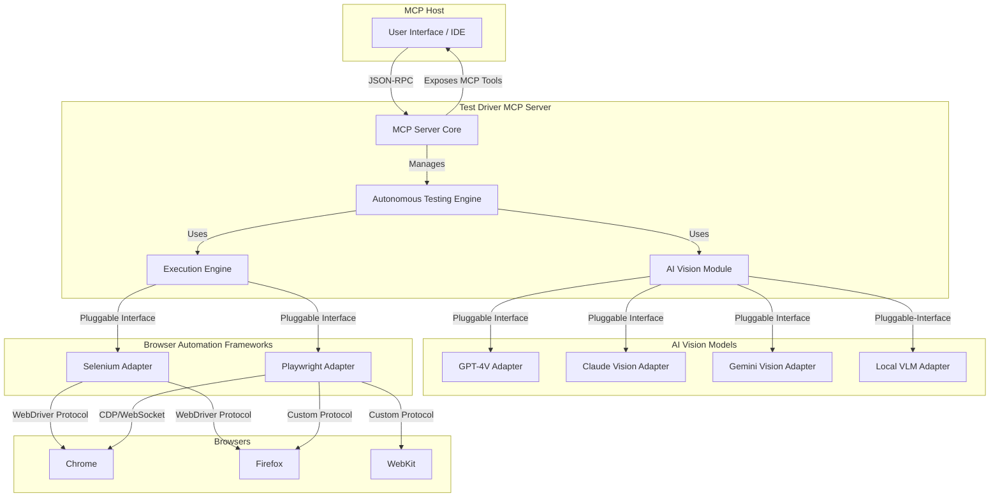

# Redesigning the Test Driver Architecture for a Modular, AI-Driven Future

## 1. Introduction

This document outlines a new, modular architecture for the Test Driver framework, designed to address the limitations of the current system and embrace a more flexible, powerful, and AI-driven approach to UI testing. The proposed architecture is built on four foundational pillars:

1.  **Decentralization and Flexibility**: Eliminating the dependency on a proprietary backend and single API key by enabling the use of local and open-source AI models.
2.  **Universal Model Compatibility**: A pluggable architecture that allows seamless integration with any agentic AI vision model, from leading proprietary APIs to self-hosted open-source alternatives.
3.  **Standardized Integration**: A Model Context Protocol (MCP) server that acts as a universal bridge, supporting both Selenium and Playwright for test execution, providing maximum flexibility and backward compatibility.
4.  **Autonomous End-to-End Testing**: Empowering the AI to not only execute tests but to understand requirements, generate comprehensive test plans, automate test cases, and deliver detailed reports.

This redesigned architecture will transform Test Driver from a closed tool into an open, extensible, and intelligent testing platform.

## 2. High-Level Architecture Overview

The new architecture is centered around the **Test Driver MCP Server**, which acts as the brain and central hub of the system. It communicates with an MCP Host (like an IDE or a chat interface) and orchestrates the two main components: the **AI Vision Module** and the **Execution Engine**.



**Key Components:**

*   **MCP Host**: The user-facing application where the testing process is initiated and monitored.
*   **Test Driver MCP Server**: The core of the system. It receives requests from the host, manages the testing lifecycle, and coordinates the other modules.
*   **Autonomous Testing Engine**: The AI-powered component responsible for test planning, generation, and reporting.
*   **AI Vision Module**: A pluggable module that provides computer vision capabilities by interfacing with various AI vision models.
*   **Execution Engine**: A pluggable module that executes browser automation commands using either Selenium or Playwright.

## 3. Component Deep Dive

### 3.1. Test Driver MCP Server

The Test Driver will be implemented as a standard MCP server, communicating via JSON-RPC 2.0. This design decouples it from any specific client and makes it universally compatible with any MCP host.

**MCP Features Exposed:**

*   **Tools**: The server will expose a rich set of tools to the MCP host, corresponding to testing actions. These tools will be dynamically generated based on the capabilities of the loaded Execution Engine adapter (Selenium/Playwright).
    *   `testdriver.startTest(requirements: string)`: Initiates the autonomous testing process.
    *   `testdriver.executeStep(action: string, params: object)`: Executes a single test step (e.g., click, type).
    *   `testdriver.getReport()`: Retrieves the latest test report.
*   **Resources**: The server will provide resources such as test plans, execution logs, screenshots, and final reports.
*   **Prompts**: The server can offer prompts for common testing scenarios, like "Perform a login test" or "Test the checkout process."

### 3.2. AI Vision Module (Pluggable)

To eliminate the dependency on a single backend and allow for flexibility, the AI Vision Module will be designed with a pluggable adapter architecture. This allows users to choose the vision model that best suits their needs for accuracy, speed, cost, and privacy.

**Standard `VisionAdapter` Interface:**

An abstract base class will define the standard interface for all vision adapters:

```python
class VisionAdapter:
    def describe_screen(self, image: bytes) -> str:
        """Returns a textual description of the entire screen."""
        pass

    def find_element(self, image: bytes, prompt: str) -> dict:
        """Finds a specific element based on a natural language prompt.
           Returns coordinates and confidence score.
        """
        pass

    def ocr(self, image: bytes) -> list:
        """Performs OCR on the image and returns text with bounding boxes."""
        pass
```

**Initial Adapters:**

*   **Proprietary Model Adapters**: `OpenAIVisionAdapter`, `AnthropicVisionAdapter`, `GoogleVisionAdapter`. These will use the respective company APIs and require API keys, but the keys will be configured on the user-side, not hardcoded in a central backend.
*   **Local VLM Adapter**: An adapter for running open-source models (like Qwen 2.5 VL or Llama 3.2 Vision) locally using frameworks like Ollama or Hugging Face Transformers. This completely eliminates external API calls and associated keys, addressing the core requirement.

### 3.3. Execution Engine (Selenium & Playwright)

To support both Selenium and Playwright, the Execution Engine will use a similar adapter pattern. This provides a unified interface for browser automation, abstracting away the differences between the two frameworks.

**Unified `BrowserDriver` Interface:**

```python
class BrowserDriver:
    def navigate(self, url: str):
        pass

    def click(self, coordinates: tuple):
        pass

    def type(self, coordinates: tuple, text: str):
        pass

    def screenshot(self) -> bytes:
        pass
```

**Framework Adapters:**

*   **`SeleniumAdapter`**: Implements the `BrowserDriver` interface using the Selenium WebDriver library. It will manage the browser drivers (chromedriver, geckodriver) and communicate via the W3C WebDriver protocol.
*   **`PlaywrightAdapter`**: Implements the `BrowserDriver` interface using the Playwright library. It will communicate with browsers over its persistent WebSocket connection.

**Dynamic Framework Selection**: The MCP server can dynamically choose which adapter to use based on the test requirements, such as the browser needed, or a user preference for speed (Playwright) vs. legacy compatibility (Selenium).

### 3.4. Autonomous Testing Engine

This engine is the core of the AI-driven functionality. It orchestrates the entire testing lifecycle, from planning to reporting.

**Workflow:**

1.  **Requirement Ingestion**: The engine receives high-level requirements as a natural language string (e.g., "Test the user registration and login flow").
2.  **Test Plan Generation**: The engine uses an AI model (which can be a separate, non-vision LLM) to break down the requirements into a structured, step-by-step test plan. This plan will be represented in a human-readable format like YAML.

    ```yaml
    test_plan:
      - description: "Navigate to the homepage and find the sign-up button."
        action: "navigate_and_click"
        params: { url: "https://example.com", element_prompt: "the sign up button" }
      - description: "Fill in the registration form."
        action: "fill_form"
        params:
          - { element_prompt: "the email input field", value: "test@example.com" }
          - { element_prompt: "the password input field", value: "password123" }
      - description: "Assert that the user is redirected to the dashboard."
        action: "assert_screen_contains"
        params: { text: "Welcome to your dashboard" }
    ```

3.  **Test Case Automation & Execution**: For each step in the plan, the engine performs the following loop:
    a.  **Capture Screen**: The `ExecutionEngine` takes a screenshot of the current browser state.
    b.  **Vision Analysis**: The screenshot and the step description (e.g., "the sign up button") are sent to the `AIVisionModule`.
    c.  **Action Planning**: The vision model returns the coordinates of the target element. The engine plans the action (e.g., a click at those coordinates).
    d.  **Execution**: The `ExecutionEngine` performs the action.
    e.  **Verification**: A new screenshot is taken, and the engine can use the vision model to assert that the expected change occurred.

4.  **Comprehensive Reporting**: After the test run, the engine compiles a detailed report including:
    *   A summary of the test plan and results.
    *   A step-by-step log with screenshots for each action.
    *   Video replay of the entire test session.
    *   Browser logs and network requests captured by the `ExecutionEngine`.
    *   AI-generated summary of any failures.

## 4. Data Flow and Workflows

A typical end-to-end test execution flow would be as follows:

1.  **User**: Provides a high-level requirement to the **MCP Host** (e.g., "Test the search functionality").
2.  **MCP Host**: Sends a `testdriver.startTest` request to the **Test Driver MCP Server**.
3.  **Autonomous Testing Engine**: Receives the request and uses an LLM to generate a YAML test plan.
4.  **Execution Loop (per step)**:
    a.  The engine instructs the **Execution Engine** (e.g., Playwright adapter) to take a screenshot.
    b.  The screenshot and the step prompt are sent to the **AI Vision Module**.
    c.  The **AI Vision Module** uses its configured adapter (e.g., Local VLM) to find the target element's coordinates.
    d.  The coordinates are returned to the engine.
    e.  The engine instructs the **Execution Engine** to perform the action (e.g., `click(x, y)`).
5.  **Reporting**: Once all steps are complete, the engine aggregates all logs, screenshots, and videos into a comprehensive HTML report and makes it available as an MCP resource.

## 5. Security Model

The architecture will adhere to the security principles of the Model Context Protocol:

*   **User Consent**: Any action that involves executing code or accessing local files will require explicit user consent, managed by the MCP Host.
*   **Data Privacy**: When using cloud-based vision models, the user will be clearly informed that screenshots are being sent to a third-party service. The ability to use a local VLM provides a fully private option.
*   **Tool Safety**: All test execution actions are treated as potentially destructive. The MCP Host will be responsible for sandboxing and providing a safe environment.

## 6. Conclusion

This proposed architecture fundamentally redesigns the Test Driver system to be more open, flexible, and intelligent. By embracing standard protocols like MCP, offering pluggable modules for AI vision and browser automation, and building a powerful autonomous testing engine, the new Test Driver will be well-positioned to lead the next generation of AI-powered software testing.
