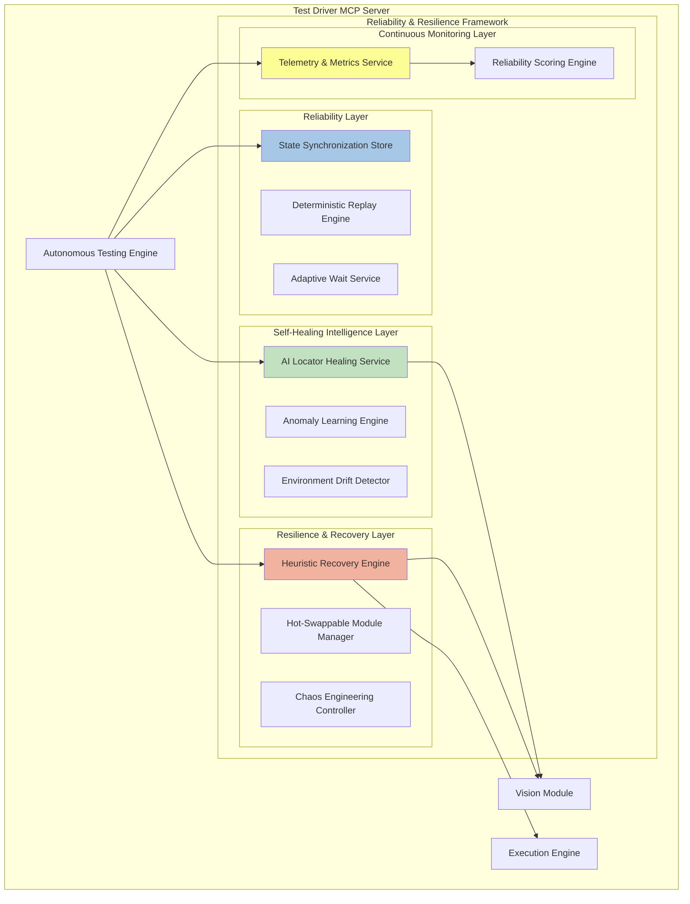
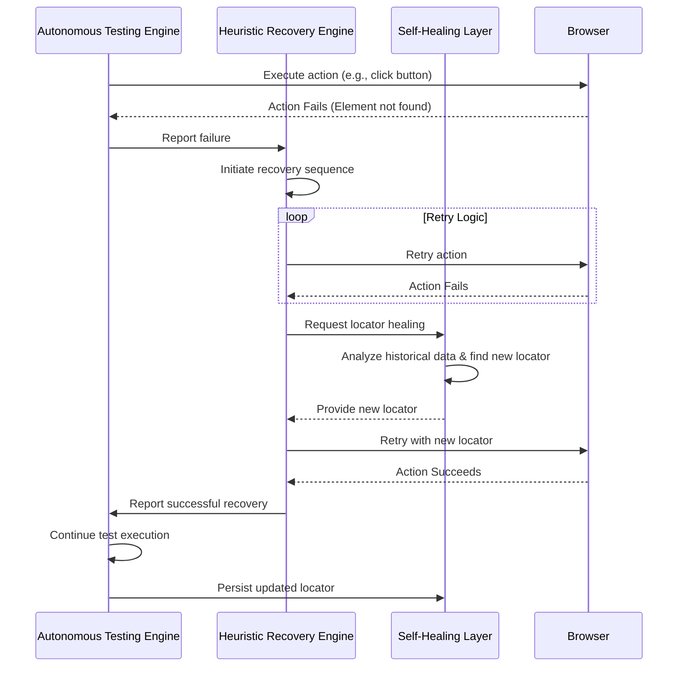

# Test Driver: Reliability, Resilience, and Self-Healing Framework

## 1. Introduction

This document outlines a comprehensive framework designed to enhance the reliability, resilience, and self-healing capabilities of the Test Driver system. By integrating advanced AI-driven mechanisms and proven reliability patterns, this framework will transform Test Driver into a highly robust and autonomous testing platform, capable of delivering stable, defect-free products with minimal human intervention.

## 2. Core Principles

The framework is built upon the following core principles:

- **Design for Failure**: Proactively anticipate and mitigate failures at every layer of the system.
- **Automate Recovery**: Implement automated recovery mechanisms to handle failures gracefully without manual intervention.
- **Learn from Failure**: Use machine learning to analyze failure patterns and continuously improve the system's resilience and self-healing capabilities.
- **Progressive Resilience**: Gradually introduce more complex resilience and self-healing strategies, starting with simple retries and evolving to predictive failure avoidance.
- **Observability**: Provide deep insights into the system's health, performance, and reliability through comprehensive telemetry and monitoring.

## 3. Architectural Overview

The framework introduces several new components that integrate seamlessly with the existing Test Driver architecture. These components are organized into distinct layers, each responsible for a specific aspect of reliability and resilience.

## 4. Component Deep Dive

### 4.1. Reliability Layer

**Goal**: Ensure deterministic, reproducible, and fault-tolerant test execution.

- **State Synchronization Store**: A Redux-style store that tracks the application's state (e.g., current page, active elements, user session). This allows the system to resume tests from a known good state after a failure, rather than restarting from the beginning.

- **Deterministic Replay Engine**: Captures and stores all inputs (keystrokes, clicks) and non-deterministic outputs (network responses, timestamps) during a test run. This enables pixel-perfect, deterministic replay of any test session for debugging hard-to-reproduce failures.

- **Adaptive Wait Service**: Replaces static waits with an AI-powered service that uses the Vision Module to confirm page and element readiness. It analyzes visual stability (e.g., pixel delta below a threshold) and waits for animations and network activity to cease before proceeding, reducing flakiness.

### 4.2. Resilience & Recovery Layer

**Goal**: Prevent single-point failures and automatically recover from runtime issues.

- **Heuristic Recovery Engine**: When a test step fails, this engine orchestrates a series of recovery strategies based on a predefined heuristic tree. For example:
    1.  **Retry**: Simple retry of the failed action.
    2.  **Alternate Locator**: If a locator fails, try an alternative (e.g., switch from XPath to visual search).
    3.  **UI Refresh**: Refresh the page and try again.
    4.  **Context Reset**: Clear cookies and local storage and retry.
    5.  **Fallback Action**: If all else fails, attempt a fallback action (e.g., navigate to the homepage).

- **Hot-Swappable Module Manager**: Monitors the health of critical modules like the Vision and Execution adapters. If an adapter crashes or becomes unresponsive, this manager can dynamically reload it or switch to a different adapter mid-run (e.g., from Playwright to Selenium).

- **Chaos Engineering Controller**: Integrates with the CI/CD pipeline to inject controlled faults into the test environment. This allows the system to proactively test its own resilience by simulating real-world failures like network latency, API errors, and resource contention.

### 4.3. Self-Healing Intelligence Layer

**Goal**: Enable the system to autonomously fix broken locators, flows, and assertions.

- **AI Locator Healing Service**: When a locator fails permanently, this service uses historical screenshots, DOM data, and vision embeddings to find the new, correct locator for the element. It then automatically updates the test script with the new locator and submits a pull request for human review.

- **Anomaly Learning Engine**: A reinforcement learning agent that analyzes test failure logs to identify recurring patterns. It can learn, for example, that a specific button is frequently slow to load and preemptively increase the wait time for that element in future test runs.

- **Environment Drift Detector**: Compares baseline screenshots and DOM structures between builds to automatically detect UI changes (drift). It can then trigger the AI Locator Healing Service to update affected tests before they fail.

### 4.4. Continuous Monitoring Layer

**Goal**: Provide a real-time, data-driven view of the system's reliability and health.

- **Telemetry & Metrics Service**: Collects and exposes a wide range of metrics, including test success rates, failure types, self-healing success rates, element drift frequency, and mean-time-to-recovery (MTTR). This data can be visualized in dashboards like Grafana.

- **Reliability Scoring Engine**: Computes a reliability score for each test case, module, and UI component based on historical performance. This allows the system to prioritize self-healing efforts on the most fragile parts of the application.

## 5. Failure Recovery Workflow

This sequence diagram illustrates how the framework handles a typical test failure:

## 6. Conclusion

This comprehensive framework for reliability, resilience, and self-healing represents a significant evolution for the Test Driver system. By moving beyond simple test execution to embrace autonomous recovery and continuous learning, Test Driver will be able to provide a level of quality assurance that is not possible with traditional testing tools. This will enable teams to deliver more stable, defect-free products with greater speed and confidence.
